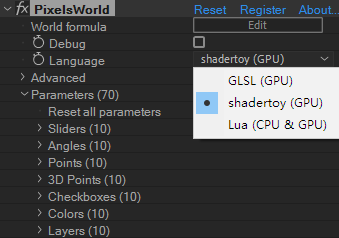

# Template Zone Shadertoy
---
## Usage
On the Shadertoy mode, you can run codes from [shadertoy.com](https://shadertoy.com). 



> **Note** <br/> It doesn't mean all code from the Shadertoy can be seamlessly transferred into PixelsWorld. Some like "VR", "Loop buffer reference" are not supported. 


##Details

Add **`_PixelsWorld_`** prefix to use variables that exist in GLSL mode. 


> E.g. `slider[0]` on GLSL mode =  `_PixelsWorld_slider[0]` on shadertoy mode. 

Refer to [this page](./predefined.md#shadertoy-mode) to learn more global definitions in the Shadertoy mode. 

It is not recommended to define your own **`_PixelsWorld_`** prefixed variables. 


## Use Buffers

Shadertoy has 4 Buffers (or iChannels), which can be also applied into PixelsWorld. 

### No-loop-ref Buffers

If the effect you want to apply doesn't involve loop references (like the bottom part of the figure above). Then the effect is "no-loop-ref". You can apply the effect via the code template below. (Also need the Lua render mode)


E.g.: An effect from https://www.shadertoy.com/view/4dVGRW 

1. This effect uses the `BufferA`, so `A` is set to `true` at the 4th line of the code below. 
2. `BufferA` is bound to the `iChannel0` of the `Main` image. So `AtoMain` is set to `0` at the 15th line. 
3. Then, copy-paste the code of `BufferA` and `Main` to the corresponding variables. 
4. Finally, to make sure the result is right, set `Advanced->Internal texture format` to `Floating point 32 bit x RGBA (HDR)` to prevent PixelsWorld to clamp the value of the Alpha color channel. 
5. Also don't forget to check if the PixelsWorld is on the Lua render mode. 

```lua:rotatingCubes.lua
version3()

enable = {
    A=true,
    B=false,
    C=false,
    D=false,

    -- '-1': disable
    -- '0~3': which iChannel to set
    
    AtoB = -1,
    AtoC = -1,
    AtoD = -1,
    AtoMain = 0,

    BtoC = -1,
    BtoD = -1,
    BtoMain = -1,

    CtoD = -1,
    CtoMain = -1,

    DtoMain = -1,
}

mainCode = [==[
// Paste the main code here. 
mat3 calcLookAtMatrix(vec3 origin, vec3 target, float roll) {
    vec3 rr = vec3(sin(roll), cos(roll), 0.0);
    vec3 ww = normalize(target - origin);
    vec3 uu = normalize(cross(ww, rr));
    vec3 vv = normalize(cross(uu, ww));
  
    return mat3(uu, vv, ww);
  }
  
  vec3 getRay(vec3 origin, vec3 target, vec2 screenPos, float lensLength) {
    mat3 camMat = calcLookAtMatrix(origin, target, 0.0);
    return normalize(camMat * vec3(screenPos, lensLength));
  }
  
  vec2 squareFrame(vec2 screenSize, vec2 coord) {
    vec2 position = 2.0 * (coord.xy / screenSize.xy) - 1.0;
    position.x *= screenSize.x / screenSize.y;
    return position;
  }
  
  vec2 getDeltas(sampler2D buffer, vec2 uv) {
    vec2 pixel = vec2(1. / iResolution.xy);
    vec3 pole = vec3(-1, 0, +1);
    float dpos = 0.0;
    float dnor = 0.0;
      
    vec4 s0 = texture(iChannel0, uv + pixel.xy * pole.xx); // x1, y1
    vec4 s1 = texture(iChannel0, uv + pixel.xy * pole.yx); // x2, y1
    vec4 s2 = texture(iChannel0, uv + pixel.xy * pole.zx); // x3, y1
    vec4 s3 = texture(iChannel0, uv + pixel.xy * pole.xy); // x1, y2
    vec4 s4 = texture(iChannel0, uv + pixel.xy * pole.yy); // x2, y2
    vec4 s5 = texture(iChannel0, uv + pixel.xy * pole.zy); // x3, y2
    vec4 s6 = texture(iChannel0, uv + pixel.xy * pole.xz); // x1, y3
    vec4 s7 = texture(iChannel0, uv + pixel.xy * pole.yz); // x2, y3
    vec4 s8 = texture(iChannel0, uv + pixel.xy * pole.zz); // x3, y3
  
    dpos = (
      abs(s1.a - s7.a) +
      abs(s5.a - s3.a) +
      abs(s0.a - s8.a) +
      abs(s2.a - s6.a)
    ) * 0.5;
    dpos += (
      max(0.0, 1.0 - dot(s1.rgb, s7.rgb)) +
      max(0.0, 1.0 - dot(s5.rgb, s3.rgb)) +
      max(0.0, 1.0 - dot(s0.rgb, s8.rgb)) +
      max(0.0, 1.0 - dot(s2.rgb, s6.rgb))
    );
    
    dpos = pow(max(dpos - 0.5, 0.0), 5.0);
      
    return vec2(dpos, dnor);
  }
  
  void mainImage(out vec4 fragColor, in vec2 fragCoord) {
    vec3 ro = vec3(sin(iTime * 0.2), 1.5, cos(iTime * 0.2)) * 5.;
    vec3 ta = vec3(0, 0, 0);
    vec3 rd = getRay(ro, ta, squareFrame(iResolution.xy, fragCoord.xy), 2.0);
    vec2 uv = fragCoord.xy / iResolution.xy;
      
    vec4 buf = texture(iChannel0, fragCoord.xy / iResolution.xy);
    float t = buf.a;
    vec3 nor = buf.rgb;
    vec3 pos = ro + rd * t;
      
    vec3 col = vec3(0.5, 0.8, 1);
    vec2 deltas = getDeltas(iChannel0, uv);
    if (t > -0.5) {
      col = vec3(1.0);
      col *= max(0.3, 0.3 + dot(nor, normalize(vec3(0, 1, 0.5))));
      col *= vec3(1, 0.8, 0.35);
    }
    col.r = smoothstep(0.1, 1.0, col.r);
    col.g = smoothstep(0.1, 1.1, col.g);
    col.b = smoothstep(-0.1, 1.0, col.b);
    col = pow(col, vec3(1.1));
    col -= deltas.x - deltas.y;
    
      
    fragColor = vec4(col, 1);
  }
]==];

commonCode = [==[
// Paste the common code here. 

]==]

bufferACode = [==[
// Paste the Buffer A code here. 
float sdBox( vec3 p, vec3 b ) {
    vec3 d = abs(p) - b;
    return min(max(d.x,max(d.y,d.z)),0.0) +
           length(max(d,0.0));
  }
  
  vec2 mirror(vec2 p, float v) {
    float hv = v * 0.5;
    vec2  fl = mod(floor(p / v + 0.5), 2.0) * 2.0 - 1.0;
    vec2  mp = mod(p + hv, v) - hv;
      
    return fl * mp;
  }
  
  vec2 rotate2D(vec2 p, float a) {
    return p * mat2(cos(a), -sin(a), sin(a),  cos(a));
  }
  
  float map(vec3 p) {
    float r = iMouse.z > 0.0 ? iMouse.x / 100.0 : iTime * 0.9;
    p.xz = mirror(p.xz, 4.);
    p.xz = rotate2D(p.xz, r);
    float d = sdBox(p, vec3(1));
    d = min(d, sdBox(p, vec3(0.1, 0.1, 3)));
    d = min(d, sdBox(p, vec3(3, 0.1, 0.1)));
    return d;
  }
  
  mat3 calcLookAtMatrix(vec3 origin, vec3 target, float roll) {
    vec3 rr = vec3(sin(roll), cos(roll), 0.0);
    vec3 ww = normalize(target - origin);
    vec3 uu = normalize(cross(ww, rr));
    vec3 vv = normalize(cross(uu, ww));
  
    return mat3(uu, vv, ww);
  }
  
  vec3 getRay(vec3 origin, vec3 target, vec2 screenPos, float lensLength) {
    mat3 camMat = calcLookAtMatrix(origin, target, 0.0);
    return normalize(camMat * vec3(screenPos, lensLength));
  }
  
  float calcRayIntersection(vec3 rayOrigin, vec3 rayDir, float maxd, float precis) {
    float latest = precis * 2.0;
    float dist   = +0.0;
    float type   = -1.0;
    float res    = -1.0;
  
    for (int i = 0; i < 30; i++) {
      if (latest < precis || dist > maxd) break;
  
      float result = map(rayOrigin + rayDir * dist);
  
      latest = result;
      dist  += latest;
    }
  
    if (dist < maxd) {
      res = dist;
    }
  
    return res;
  }
  
  vec2 squareFrame(vec2 screenSize, vec2 coord) {
    vec2 position = 2.0 * (coord.xy / screenSize.xy) - 1.0;
    position.x *= screenSize.x / screenSize.y;
    return position;
  }
  
  vec3 calcNormal(vec3 pos, float eps) {
    const vec3 v1 = vec3( 1.0,-1.0,-1.0);
    const vec3 v2 = vec3(-1.0,-1.0, 1.0);
    const vec3 v3 = vec3(-1.0, 1.0,-1.0);
    const vec3 v4 = vec3( 1.0, 1.0, 1.0);
  
    return normalize( v1 * map( pos + v1*eps ) +
                      v2 * map( pos + v2*eps ) +
                      v3 * map( pos + v3*eps ) +
                      v4 * map( pos + v4*eps ) );
  }
  
  vec3 calcNormal(vec3 pos) {
    return calcNormal(pos, 0.002);
  }
  
  void mainImage(out vec4 fragColor, in vec2 fragCoord) {
    vec2 uv = squareFrame(iResolution.xy, fragCoord.xy);
    vec3 ro = vec3(sin(iTime * 0.2), 1.5, cos(iTime * 0.2)) * 5.;
    vec3 ta = vec3(0, 0, 0);
    vec3 rd = getRay(ro, ta, uv, 2.0);
      
    float t = calcRayIntersection(ro, rd, 20.0, 0.001);
    vec3 pos = ro + rd * t;
    vec3 nor = calcNormal(pos);
      
    fragColor = vec4(nor, t);
  }
]==];

bufferBCode = [==[
// Paste the Buffer B code here. 

]==];

bufferCCode = [==[
// Paste the Buffer C code here. 

]==];

bufferDCode = [==[
// Paste the Buffer D code here. 

]==];


-- == WARNING WARNING WARNING WARNING WARNING == --
-- == Code below this line should not be modified. == --

-- Code By ZzStarSound 
-- This preset code should only be used inside PixelsWorld. 
-- Any abusing of the code is not permitted. 


swapTexDet = function(sch,tch)
    if sch == nil or tch == nil then return end
    if sch >= 0 and sch <= 3 then
        swapTex(sch,tch)
    end
end


if enable.A then 
    texA = newTex(width,height)
    shadertoy(commonCode .. bufferACode)
    swapTex(texA,OUTPUT)
end

if enable.B then
    texB = newTex(width,height)
    swapTexDet(enable.AtoB,texA)
    shadertoy(commonCode .. bufferBCode)
    swapTexDet(enable.AtoB,texA)
end

if enable.C then
    texC = newTex(width,height)
    swapTexDet(enable.AtoC,texA)
    swapTexDet(enable.BtoC,texB)
    shadertoy(commonCode .. bufferCCode)
    swapTexDet(enable.AtoC,texA)
    swapTexDet(enable.BtoC,texB)
end

if enable.D then
    texD = newTex(width,height)
    swapTexDet(enable.AtoD,texA)
    swapTexDet(enable.BtoD,texB)
    swapTexDet(enable.CtoD,texC)
    shadertoy(commonCode .. bufferDCode)
    swapTexDet(enable.AtoD,texA)
    swapTexDet(enable.BtoD,texB)
    swapTexDet(enable.CtoD,texC)
end

swapTexDet(enable.AtoMain,texA)
swapTexDet(enable.BtoMain,texB)
swapTexDet(enable.CtoMain,texC)
swapTexDet(enable.DtoMain,texD)
shadertoy(commonCode .. mainCode)
swapTexDet(enable.AtoMain,texA)
swapTexDet(enable.BtoMain,texB)
swapTexDet(enable.CtoMain,texC)
swapTexDet(enable.DtoMain,texD)
```

### Loop-ref Buffer

Um...We really don't recommend applying the Loop-ref Buffer. (But there still a way to do it. You should get ready to fight with Ae and PixelsWorld for a long night. [I'm ready to go>>>](./../Lua/Simulation.md))

