# Function List
--- 

Below is a list of functions defined in Lua mode for PixelsWorld.

**Mandatory Declaration Function**

[version3](#version3)

**Parameter Retrieval Functions**

[slider](LinkParameters.md),
[angle](LinkParameters.md),
[point](LinkParameters.md),
[point3d](LinkParameters.md),
[checkbox](LinkParameters.md),
[color](LinkParameters.md),
[layer](LinkParameters.md)

**Output Information Functions**

[print](#print),
[println](#println),
[alert](#alert)

**Transformation Functions**

[move](#move),
[scale](#scale),
[rotate](#rotate),
[rotateX](#rotatex),
[rotateY](#rotatey),
[rotateZ](#rotatez),
[twirl](#twirl)

[beginGroup](#begingroup),
[endGroup](#endgroup),
[beginGlobal](#beginglobal),
[endGlobal](#endglobal)

[global2local](#global2local),
[local2global](#local2global),
[global2screen](#global2screen),
[screen2global](#screen2global)

[getTransformMatrix](#gettransformmatrix)

**Drawing Functions**

> Primitives

[tri](#tri),
[quad](#quad),
[rect](#rect),
[circle](#circle),
[ellipse](#ellipse),
[par](#par),
[line](#line)

[cube](#cube),
[tet](#tet),
[cone](#cone),
[ball](#ball),
[tube](#tube)

[image](#image),
[imageAlign](#imagealign),
[imageAnchor](#imageanchor)

[text](#text),
[textSize](#textsize),
[textFont](#textfont),
[textAlign](#textalign),
[textAnchor](#textanchor),
[textAlignOuter](#textalignouter),
[textInterval](#textinterval),
[textAdvanceScale](#textadvancescale)

[coord](#coord),
[grid](#grid)

[poly](Poly.md),
[setPoly](#setpoly)

[background](#background),
[in2out](#in2out) 

> Drawing Attribute Controls

[dim2](#dim2),
[dim3](#dim3)

[perspective](#perspective),
[noPerspective](#noperspective)

[fill](#fill),
[noFill](#nofill),
[stroke](#stroke),
[noStroke](#nostroke),
[dot](#dot),
[noDot](#nodot)

[wireframe](#wireframe),
[noWireframe](#nowireframe)

[blendAlpha](#blendalpha),
[noBlendAlpha](#noblendalpha)

[back](#back),
[noBack](#noback)

[pure](#pure),
[phong](#phong),
[anime](#anime)

[rgba](#rgba),
[depth](#depth),
[normal](#normal)

[setDepth](#setdepth)

> Lighting

[newLight](#newlight),
[delLight](#dellight),
[getLightInfo](#getlightinfo)

[activateLight](#activatelight),
[deactivateLight](#deactivatelight),
[getActivatedLight](#getactivatedlight),
[setActivatedLight](#setactivatedlight)

[fetchLight](#fetchlight)

[ambientLight (legacy)](#ambientlight),
[pointLight (legacy)](#pointlight),
[parallelLight (legacy)](#parallellight)

[clearLight (legacy)](#clearlight),
[getLight (legacy)](#getlight)  

> Camera

[aeCamera](#aecamera),
[lookAt](#lookat),
[viewSpace](#viewspace)  

> Stroked Detail

[strokeWidth](#strokewidth),
[strokeDivision](#strokedivision),
[strokeGlobal](#strokeglobal),
[strokeLocal](#strokelocal)  

> Dot Rendering Detail

[dotRadius](#dotradius),
[dotDivision](#dotdivision),
[dotGlobal](#dotglobal),
[dotLocal](#dotlocal) 

> Output Detail

[smooth](#smooth),
[noSmooth](#nosmooth) 

**Texture Manipulation**

[newTex, delTex, getSize, swapTex, drawTo, castTex, blendTex, copyTex, savePNG, loadPNG, saveEXR, loadEXR, rotateTex, flipTex, resizeTex, trimTex](Texture.md)

**Utilities**

[r2d](#r2d),
[d2r](#d2r)

[map](#map)
[clamp](#clamp)
[step](#step)
[smoothStep](#smoothstep)
[bezier](#bezier)

[rgb2hsl,hsl2rgb,rgb2hsv,hsv2rgb,rgb2cmy,cmy2rgb,rgb2cmyk,cmyk2rgb,cmy2cmyk,cmyk2cmy,hsl2hsv,hsv2hsl](#color-conversion)

[utf8ToLocal](#utf8tolocal),
[localToUtf8](#localtoutf8)

[getGLInfo](#getglinfo),
[getDrawRecord](#getdrawrecord),
[getStatus](#getstatus)

[getAudio](#getaudio)  

[loadString](#loadstring)
[saveString](#savestring)

**Pixel Reading and Writing Functions**

[getColor](#getcolor),
[setColor](#setcolor),
[getSize](#getsize),

**Code Execution Functions**

[shadertoy](#shadertoy),
[glsl](#glsl),
[cmd](#cmd),
[lua](#lua),
[runFile](#runfile),
[txt](#txt)  

---
<br><br><br><br><br>
# Detailed Explanation

## version3

The function `version3()` must be declared in the first line in Lua mode. Its purpose is to import all functions under the `pw3` table into the global scope. If this line is missing, you need to prefix all functions provided by PixelsWorld with `pw3.`, such as the `println()` function, which would need to be written as `pw3.println()`. Conversely, if you call the `version3()` function at the beginning of your code, you do not need the `pw3.` prefix. This design is intended to ensure backward compatibility with your code. We recommend that you include a call to `version3()` in the first line of any Lua rendering mode code in all circumstances.

```lua:version3.lua
version3()
println("Hello PixelsWorld! ")
```

```lua:without_version3.lua
pw3.println("Hello PixelsWorld! ")
```

## print

`print(str)`, `print(str,brightness)`, `print(str,r,g,b)`, `print(str,r,g,b,a)` are functions to output information on the top left corner of the screen.

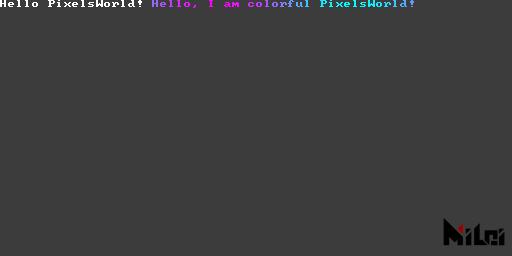

```lua:print.lua
version3()
print("Hello PixelsWorld! ")
str = "Hello, I am colorful PixelsWorld! "
for i=1,#str do
local c = str:sub(i,i)
local phase = math.sin(i/#str*TPI + time*10) / 2 + .5
print(c,phase,1-phase,1,1)
end
```

## println

`println(str)`, `println(str, brightness)`, `println(str, r, g, b)`, `println(str, r, g, b, a)` are functions for outputting information in the top left corner of the screen, with each output followed by a newline.


```lua:println.lua
version3()
println("Hello PixelsWorld! ")
str = "Hello, I am colorful PixelsWorld! "
for i=1,#str do
local c = str:sub(i,i)
local phase = math.sin(i/#str*TPI + time*10) / 2 + .5
-- println(c,phase,1-phase,1,1)
print(c,phase,1-phase,1,1)
end
```

## alert

`alert(str)` is a function to output **warning messages** in the top left corner of the screen. It is currently equivalent to `println(str, 1, 1, 0, 1)`.

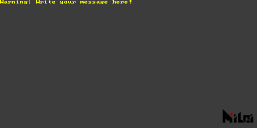

```lua:alert.lua
version3()
alert("Warning: Write your message here! ")
```

## move

`move(x,y)`,`move(x,y,z)`moves Paintbrush. 

> All transformations are performed based on the current Paintbrush coordinates.

Example: 


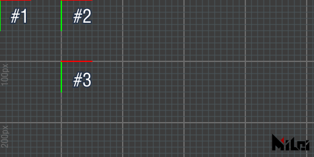

```lua:move.md
version3()
coord() -- Display Paintbrush position before transformation
move(100,0)
coord() -- Display Paintbrush position after 1st transformation
move(0,100)
coord() -- Display Paintbrush position after 2nd transformation
```
Eventually, the Paintbrush will be at position `(100, 100, 0)`.

## scale

`scale(ratio)`,`scale(x,y)`,`scale(x,y,z)`scales the Paintbrush coordinate. 

> All transforms are done basing on the Paintbrush coordinate. 


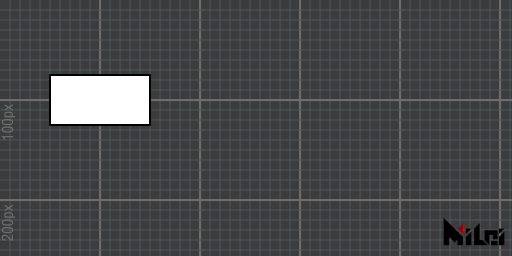

```lua:scale.lua
version3()
move(100,100)
scale(2)
rect(50,25)
```
--- 

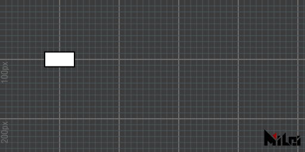

```lua:no_scale.lua
version3()
move(100,100)
--scale(2)
rect(50,25)
```

## rotate
## rotateX
## rotateY
## rotateZ

`rotate(theta)` is a function to rotate the Paintbrush coordinates by `theta` radians, `rotateX(theta)` rotates the Paintbrush coordinates along its X-axis, and `rotate(theta)` is essentially equivalent to `rotateZ(theta)`.
> - All transformations are performed based on the current Paintbrush coordinates.
> - If you are unfamiliar with radians, you can use the function `d2r(degree)` to convert degrees into radians. For example: `rotate(d2r(90))` rotates by ninety degrees.


```lua:rotate_degree.lua
version3()
move(100, 100)
rotate(d2r(45))
rect(50, 25)
```
---


```lua:rotate_radian.lua
version3()
move(100, 100)
rotate(PI/4)
rect(50, 25)
```
---


```lua:rotateX.lua
version3()
dim3()
move(100, 100)
grid()
coord()
rotateX(d2r(45))
cube(50, 25, 10)
```
---

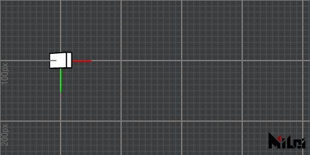

```lua:rotateY.lua
version3()
dim3()
move(100, 100)
grid()
coord()
rotateY(d2r(45))
cube(50, 25, 10)
```

---


```lua:rotateZ.lua
version3()
dim3()
move(100, 100)
grid()
coord()
rotateZ(d2r(45))
cube(50, 25, 10)
```

## twirl
`twirl(theta, x, y, z)` is a function to rotate the Paintbrush coordinate along the `(x, y, z)` axis by `theta` radians. For instance, the above `rotateX(theta)` is equivalent to `twirl(theta, 1, 0, 0)`.
> - All transformations are performed based on the current PaintBrush coordinates.
> - `twirl` uses a matrix implementation for quaternion rotation.


```lua:twirl.lua
version3()
dim3()
move(100, 100)
grid()
coord()
stroke(1, 1, 0)
line(-50, -50, -50, 50, 50, 50)
stroke(0, 0, 0)
twirl(d2r(90), 1, 1, 1)
cube(50, 25, 10)
```

## beginGroup
## endGroup

1. `beginGroup()`, `endGroup()` are functions to create parent-child relationships. Transformations (`move, scale, rotate, twirl`) between `beginGroup()` and `endGroup()` are undone after `endGroup()`.
1. `beginGroup(mat)` creates a parent-child relationship and pushes a 4x4 matrix mat into the scene (you can use [getTransformMatrix](#gettransformmatrix) to obtain transformation matrix).

> It is equivalent to `pushMatrix()` and `popMatrix()` in Processing.

For example, the following two code blocks are equivalent:


```lua:group.lua
version3()
for i = 1, 6 do
    beginGroup()
    move(i * 25, i * 25)
    rotate(d2r(15 * i))
    rect(25)
    endGroup()
end
```

---


```lua:without_group.lua
version3()
for i = 1, 6 do
    move(i * 25, i * 25)
    rotate(d2r(15 * i))
    rect(25)
    rotate(d2r(-15 * i))
    move(-i * 25, -i * 25)
end
```

## beginGlobal
## endGlobal
Drawing functions enclosed in `beginGlobal`, `endGlobal`
will temporarily draw in the global coordinate system.


```lua:beginGlobal.lua
version3()
move(100, 100)
fill(0, 1, 0) -- green
rect(50) -- Draw on (100, 100, 0)
beginGlobal()
fill(1, 0, 0) -- red
rect(50) -- Draw on (0, 0, 0)
endGlobal()
move(100, 100)
fill(0, 0, 1) -- blue
rect(50) -- Draw on (200, 200, 0)
```

## global2local

`global2local(x, y, z)` converts global coordinates to local coordinates and returns three double values.

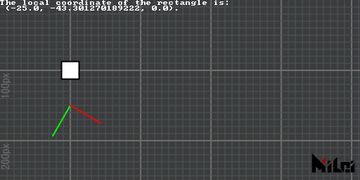

```lua:global2local.lua
version3()
move(100, 100)
rect(25)
move(0, 50)
rotate(d2r(30))
coord()
x, y, z = global2local(100, 100, 0)
println("The local coordinate of the rectangle is:\n (" .. x .. ", " .. y .. ", " .. z .. ").")
```

## local2global

`local2global(x, y, z)` converts local coordinates to global coordinates and returns three doubles.


```lua:local2global.lua
version3()
move(100, 100)
move(0, 50)
rotate(d2r(30))
coord()
move(25, 50)
rect(25)
x, y, z = local2global(0, 0, 0)
println("The global coordinate of the rectangle is:\n (" .. x .. ", " .. y .. ", " .. z .. ").")
```

## global2screen

`global2screen(x, y, z)` converts global coordinates to screen coordinates and returns three doubles.

> This conversion is affected by perspective mode. 


```lua:global2screen.lua
version3()
dim3()
move(100, 100, 0)
move(0, 50, 0)
rotateZ(d2r(30))
coord()
move(25, 50, 0)
cube(25)
x, y, z = global2screen(local2global(0, 0, 0))
println("The screen coordinate of the rectangle is:\n (" .. x .. ", " .. y .. ", " .. z .. ").")
```


## screen2global

`screen2global(x, y, z)` converts screen coordinates to global coordinates and returns three doubles.

> This conversion is affected by perspective mode. 


```lua:screen2global.lua
version3()
dim3()

x, y, z = screen2global(0, 0, 0)
println("The global coordinate of the camera is:\n (" .. x .. ", " .. y .. ", " .. z .. ").")
```

## getTransformMatrix

`getTransformMatrix()` returns a column-major 4x4 transformation matrix. This transformation matrix can be applied in `beginGroup(mat)`.

> `mat[i][j]` can access the element at column `i`, row `j`. (`i`, `j` range 1~4)

Example:


```lua:matrix.lua
version3()
dim3()

beginGroup()
move(width/3, height/3)
twirl(d2r(30), 1, 1, 1)
cubetransform = getTransformMatrix()
endGroup()

beginGroup(cubetransform)
cube(50)
endGroup()
```

## tri
1. `tri(radius)` creates an equilateral triangle inscribed in a circle with radius `radius` and points in the positive y-direction of the Paintbrush coordinate.
1. `tri()` is equivalent to `tri(100)`
1. `tri(w, h)` creates an isosceles triangle with base `w` and height `h`.
1. `tri(p1x, p1y, p2x, p2y, p3x, p3y)` creates a triangle with vertices at the 2D points `p1, p2, p3`.
1. `tri(p1x, p1y, p1z, p2x, p2y, p2z, p3x, p3y, p3z)` creates a triangle with vertices at the 3D points `p1, p2, p3`.

> - To observe a 3D triangle, please add `dim3()` after the `version3()` function and set up a camera view in the Ae layer.
> - Triangles constructed by the first three methods have normals by default in the negative direction of the z-axis of the Paintbrush coordinate, while the triangles from the last two are geometrically normal by `cross(p1-p2, p3-p2)`.
> - The function name is a shorthand for `triangle`.


```lua:tri1.lua
version3()
move(width/2, height/2)
tri(100)
```
---


```lua:tri5.lua
version3()
dim3()
move(width/2, height/2)
tri(0, 0, 100, 50, 0, 0, 0, 50, 0)
```

## quad
1. `quad(p1x, p1y, p2x, p2y, p3x, p3y, p4x, p4y)`
1. `quad(p1x, p1y, p1z, p2x, p2y, p2z, p3x, p3y, p3z, p4x, p4y, p4z)`

> - Draw the first triangle in the order of `p1, p2, p3`, and the second triangle in the order of `p1, p3, p4`.


```lua:quad.lua
version3()
move(200, 100)
quad(0, 0, 75, 0, 50, 40, 0, 15)
```

## rect

1. `rect(size)` draws a square with the given size.
2. `rect()` is equivalent to `rect(100)`
3. `rect(width, height)` draws a rectangle with the specified `width` and `height`.

> - The rectangle is generated with its center as the intersection point of the diagonal in the Paintbrush coordinate system.
> - The function name is a shorthand for `rectangle`.


```lua:rect.lua
version3()
move(200, 100)
rect(100, 75)
```

## circle

1. `circle(radius)` draws a circle with a radius of `radius`.
2. `circle()` is equivalent to `circle(100)`
3. `circle(radius, div)` draws a circle with a radius of `radius` and `div` segments.

> The default number of segments is 128.


```lua:circle.lua
version3()

move(100, 100)
fill(1, 0, 0)
circle(25)

move(100, 0)
fill(0, 1, 0)
circle(25, 10)

move(100, 0)
fill(0, 0, 1)
circle(25, 3)
```

## ellipse
1. `ellipse(radiusx, radiusy)` draws an ellipse with an x-radius of `radiusx` and a y-radius of `radiusy`.
2. `ellipse()` is equivalent to `ellipse(100, 100)`
3. `ellipse(radiusx, radiusy, div)` draws an ellipse with an x-radius of `radiusx`, a y-radius of `radiusy`, and `div` segments.

> The default number of segments is 128.

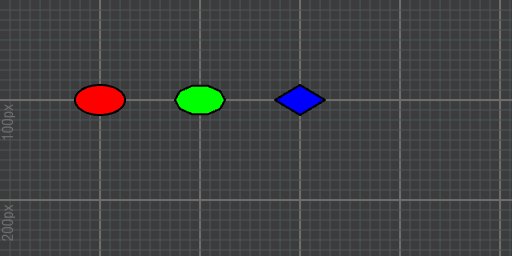

```lua:ellipse.lua
version3()

move(100, 100)
fill(1, 0, 0)
ellipse(25, 15)

move(100, 0)
fill(0, 1, 0)
ellipse(25, 15, 10)

move(100, 0)
fill(0, 0, 1)
ellipse(25, 15, 4)
```

## line

1. `line(p1x, p1y, p2x, p2y)` draws a line segment.
1. `line(p1x, p1y, p1z, p2x, p2y, p2z)` draws a 3D line segment.
1. `line()` is equivalent to `line(0, 0, 0, 100, 100, 100)`

> - The color of the line is controlled by `stroke(r, g, b)`.
> - The thickness of the line is controlled by `strokeWidth(width)`.
> - Lines are rendered by default; to disable line rendering, use `noStroke()`, and to enable it, use `stroke()`.


```lua:line.lua
version3()

move(200, 100, 0)
stroke(1, 0, 0)
line(0, 0, 0, 50)

move(100, 0, 0)
stroke(0, 1, 0)
line(0, 0, 0, 50)

move(100, 0, 0)
stroke(0, 0, 1)
line(0, 0, 0, 50)
```
---


```lua:line_circle.lua
version3()
math.randomseed(1)
num = 32

move(width/2, height/2)

for i=1, num do
    beginGroup()
    rotateZ(d2r(360/num*i))
    strokeWidth(math.random()*3)
    line(0, 0, 100, 0)
    endGroup()
end
```
## par

1. `par(x)` draws a point at position `(x,0,0)`.
2. `par(x, y)` draws a point at position `(x, y, 0)`.
3. `par(x, y, z)` draws a point at position `(x, y, z)`.
4. `par()` is equivalent to `par(0,0,0)`.

> - Point rendering is off by default; use `dot()` to enable it. You can disable it at any time with `noDot()`.
> - The radius of the point is controlled by `dotRadius(radius)`.
> - The color of the point is controlled by `dot(r, g, b)`.
> - If you do not want the point to be distorted or shrunk, use `dotGlobal()`. By default, points are rendered in `dotLocal()` mode.


```lua:par.lua
version3()

dot()
dotRadius(3)
move(200, 100)
par()

dot(1, 0, 0)
dotRadius(7)
move(100, 0)
par()
```


## cube

1. `cube(size)` draws a cube with a side length of `size`.
1. `cube(sizex, sizey, sizez)` draws a cuboid with dimensions `sizex, sizey, sizez`.
1. `cube()` is equivalent to `cube(100)`.

> The normals of the cuboid are outward by default. Negative lengths or the use of `scale()` with a negative sign may result in inward normals.


```lua:cube.lua
version3()
dim3()

move(200, 100, 0)
rotateY(d2r(30))
rotateX(d2r(30))
cube(40, 25, 10)
```

## tet 

1. `tet(radius)` draws an inscribed regular tetrahedron with a spherical radius of `radius`.
1. `tet()` is equivalent to `tet(50)`.
1. `tet(p1x, p1y, p1z, p2x, p2y, p2z, p3x, p3y, p3z, p4x, p4y, p4z)` draws a tetrahedron with vertices at `p1, p2, p3, p4`.

> - The normals of tetrahedra drawn using the third method are determined by the drawing order: vertices are drawn in the order `p1, p2, p3; p2, p1, p4; p3, p2, p4; p1, p3, p4`. Please refer to the `tri` section for triangle normal directions.
> - The function name is a shorthand for `tetrahedron`.


```lua:tet.lua
version3()
dim3()

move(200, 100, 0)
tet(0, 0, 0,
100, 0, 0,
0, 100, 0,
30, 20, -50
)
```

## cone

1. `cone(size)` draws a cone with a base radius of `size` and height `2*size`.
1. `cone()` is equivalent to `cone(50)`.
1. `cone(radius, height)` draws a cone with a radius of `radius` and height of `height`.
1. `cone(radius, height, div)` draws a cone with a radius of `radius`, height of `height`, and segmented into `div` sections.

> - The default number of segments is 64.
> - When the number of segments is greater than 16, the cone face outlines and base vertices will be hidden.
> - Negative input values or the use of `scale()` with a negative sign may result in inward normals.


```lua:cone.lua
version3()
dim3()
move(100, 100, 0)

beginGroup()
rotateY(d2r(60))
cone(25)
endGroup()

move(100, 0, 0)
beginGroup()
rotateY(d2r(60))
noStroke()
cone(25)
endGroup()

move(100, 0, 0)
beginGroup()
rotateY(d2r(60))
stroke(1, 0, 0)
dot(1, 1, 0)
dotRadius(3)
cone(30, 100, 12)
endGroup()
```

## ball

1. `ball(radius)` draws a 3D sphere with a radius of `radius`.
1. `ball()` is equivalent to `ball(50)`.
1. `ball(radius, level)` draws a sphere with a radius of `radius` and subdivision level of `level`.

> - The default level is 4.
> - Level must be greater than or equal to 0.
> - A level of 0 results in an octahedron.
> - When the level is greater than 2, outlines and vertices will be hidden.
> - Negative input values or the use of `scale()` with a negative sign may result in inward normals.


```lua:ball.lua
version3()
dim3()
move(200, 100, 0)

beginGroup()
rotateY(d2r(60))
ball(25)
endGroup()

move(100, 0, 0)
beginGroup()
rotateY(d2r(60))
stroke(0, 0.25, 0.5)
dot(0, 0.5, 1)
dotRadius(3)
ball(30, 2)
endGroup()
```

## tube

1. `tube(size)` draws a cylinder with a base radius of `size` and height `2*size`.
1. `tube()` is equivalent to `tube(50)`.
2. `tube(radius, height)` draws a cylinder with a radius of `radius` and height of `height`.
3. `tube(radius1, radius2, height)` draws a cylinder with a base radius of `radius1` near the Paintbrush coordinate origin, a base radius of `radius2` on the far side, and height of `height`.
4. `tube(radius1, radius2, height, div)` adds segment control to the fourth function.
5. `tube(radius1, radius2, height, div, needMesh)` adds a boolean to control whether to render the two circular faces based on the fifth function.
6. `tube(radius1, radius2, height, div, needMesh1, needMesh2)` adds booleans `needMesh1` to control rendering of the near side base and `needMesh2` for the far side base based on the fifth function.

> - `div` defaults to 64.
> - `needMesh` defaults to `true`.
> - When the number of segments is more than 16, the cylinder's side outlines and vertices on both bases will be hidden.
> - Negative input values or the use of `scale()` with a negative sign may result in inward normals.


```lua:tube.lua
version3()
dim3()
move(200, 100, 0)

beginGroup()
rotateY(d2r(60))
tube(25)
endGroup()

move(100, 0, 0)
beginGroup()
rotateY(d2r(60))
stroke(1, 0.25, 0.5)
dot(0, 0, 1)
dotRadius(3)
tube(30, 25, 50, 8)
endGroup()
```

## image

1. `image(id, width, height)` draws an image of specified `width` and `height` onto the scene.

> - `id` is the texture identifier, `PARAM0` to `PARAM9` are textures obtained from the plugin panel's layer controls, `INPUT` is the input image to the plugin, and `OUTPUT` is the output image.
> - Specifying `OUTPUT` as `id` triggers a screen capture action of the current drawing since `OUTPUT` is the texture used as your drawing board, making it slightly slower than other parameters.
> - The difference between this function and `in2out(id)` is that `image(id, width, height)` interacts with the scene's depth information based on the Paintbrush coordinates. This means the image is rendered upside down by default, as Ae's coordinate system has a downward y-axis; you should add a `rotateX(PI)` before to correct this (using `scale(1, -1)` is not recommended, as it could cause incorrect normals in subsequent shapes). In contrast, `in2out(id)` ignores depth information and writes pixels directly onto the current drawing board (without the upside-down issue).

The example below demonstrates a cube interacting with the input image.

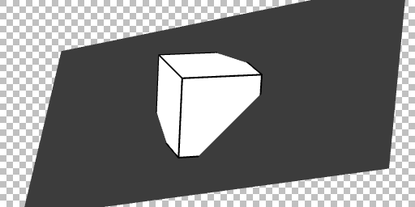

```lua:render_image.lua
version3()
dim3()
move(width/2, height/2)
twirl(d2r(45), -1, 1, 0)
beginGroup()
rotateX(d2r(180))
image(INPUT, width, height)
endGroup()
twirl(d2r(60), 1, 1, 1)
cube()
```

## imageAlign

> New in `v3.3.0`.

Use `imageAlign(rule)` to change the orientation of the image in the `image` function. `rule` follows these rules:
- `rule` is a string of length 4.
- The 1st character is `+` or `-`.
- The 2nd character is one of `x, y, z`.
- The 3rd character is `+` or `-`.
- The 4th character is one of `x, y, z`.

`rule` specifies how the UV coordinates of an image (origin at the lower left corner) align with the axes of the Paintbrush coordinate system. The default `rule` is `"+x+y"`, meaning the u-axis aligns with positive x and the v-axis with positive y.

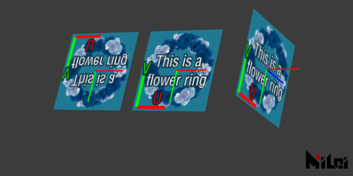

```lua:imageAlign.lua
version3()
dim3()

move(100, 100, 0)
coord()
image(PARAM0, 128, 128)

move(150, 0, 0)
coord()
imageAlign("+x-y")
image(PARAM0, 128, 128)

move(150, 0, 0)
coord()
imageAlign("+z-y")
image(PARAM0, 128, 128)
```

## imageAnchor

> New in `v3.5.0`.

- `imageAnchor(u, v)` specifies the position of the image anchor point.
- `imageAnchor(a)` is a shorthand for `imageAnchor(a, a)`.


## text

> New in `v3.5.0`

`text(str)` is used to render text on the screen.

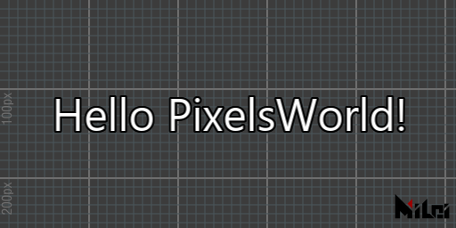

```lua:text.lua
version3()
move(width/2, height/2)
textAlign("+x-y")
text("Hello PixelsWorld!")
```

You can also use the following functions to change the text style:

- Text fill color: [fill(r,g,b)](#fill)
- Text stroke color: [stroke(r,g,b)](#stroke)
- Disable fill: [noFill()](#nofill)
- Disable stroke: [noStroke()](#nostroke)
- Stroke thickness: [strokeWidth(width)](#strokewidth)
- Font: [textFont(fontFileName)](#textfont)
- Font size: [textSize(size)](#textsize)
- Letter spacing: [textInterval(dx,dy)](#textinterval)
- Text width proportional scaling: [textAdvanceScale(rx,ry)](#textadvancescale)

## textSize

> New in `v3.5.0`

- `textSize(size, resolution)` sets the size and resolution for the text to be drawn. `size` controls the text size, and `resolution` controls the text resolution.
- `textSize(size)` is equivalent to `textSize(size, size)`


```lua:textSize.lua
version3()
textAlign("+x-y")
textAnchor(0, 1)
for i = 1, 13 do
    local sz = i + 8
    textSize(sz)
    text("~MiLai visual performance group~")
    move(0, sz + 4)
end
```

## textFont

> New in `v3.5.0`

- `textFont(fontFileName)` sets the font for the text to be drawn. `fontFileName` is the file name of the font within the `C:\Windows\Fonts` folder (you can see the file name by checking the properties through right-click).

> You can also enter the full path of the font file. This means you can access fonts from any location (e.g., `textFont([[D:\MyFolder\arial.ttf]])`).


```lua:textFont.lua
version3()

textAlign("+x-y")
textAnchor(0, 1)
textSize(20)

font_list = {
{"arial.ttf", "The quick brown fox jumps over the lazy dog."},
{"MATURASC.TTF", "The quick brown fox jumps over the lazy dog."},
{"KUNSTLER.TTF", "The quick brown fox jumps over the lazy dog."},
{"msmincho.ttc", "色は匂へど　散りぬるを"},
{"UDDigiKyokashoN-R.ttc", "我が世誰ぞ　常ならむ"},
{"STXINGKA.TTF", "人生得意须尽欢 莫使金樽空对月"},
{"msjh.ttc", "山氣日夕佳 飛鳥相與還"},
{"simsun.ttc", "吥葽 莣記莪、伱知道 莪 拿起伱 就 倣吥丅。"},
{"STZHONGS.TTF", "○●対沵倾注ㄋ珴所侑旳温柔︶ㄣ"},
}

for i = 1, #font_list do
    textFont(font_list[i][1])
    text(font_list[i][2])
    move(0, 28)
end
```

## textAlign 

> New in `v3.5.0`

`textAlign(rule)` is used to set the rendering orientation of the font. `rule` is the same as in `imageAlign(rule)`.

[See imageAlign details >>>](#imagealign)

## textAnchor 

> New in `v3.5.0`

`textAnchor(x, y)` is used to set the anchor point position of the font.

[See imageAnchor details >>>](#imageanchor)

## textAlignOuter

> New in `v3.5.0`

`textAlignOuter(flag)` sets whether to align the text using the outer outline. `flag` is a boolean value.

## textInterval

> New in `v3.5.0`

`textInterval(x, y)` sets the spacing for text mapping. Default is `x:0, y:0`.

## textAdvanceScale

> New in `v3.5.0`

`textAdvanceScale(rx, ry)` controls the advancement scaling of text mapping. Default is `rx:1, ry:1`.


## coord

`coord()` visualizes the current Paintbrush coordinates.


```lua:coord.lua
version3()

move(100, 100)
coord()

move(150, 0)
coord()

rotate(d2r(30))
move(50, 0)
scale(2, 1)
coord()
```

## grid 

`grid()` visualizes a grid on the xy plane at the current Paintbrush coordinates with a grid size of 100x100.

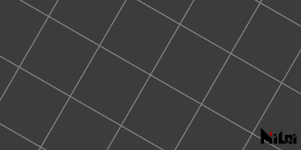

```lua:grid.lua
version3()

move(width/2, height/2)
rotate(d2r(30))
grid()
```

## setPoly

`setPoly(obj)` can pre-parse the object information to be drawn. After setting, you can call `poly()` to quickly render the object that was just set.

> - When you draw the same object multiple times in a scene, using this function to set the object in advance will be efficient.
> - For information on constructing `obj`, please refer to the [Poly](Poly.md) section.

## background

`background(brightness)`, `background(r,g,b)`, `background(r,g,b,a)` fills the current canvas with the specified color.

> - Note: If you have previously drawn shapes, they will be covered.


```lua:background.lua
version3()

background(1, 1, 0)
```

## in2out

1. `in2out(id)` sets the specified layer parameter as the background.
1. `in2out()` is equivalent to `in2out(INPUT)`, which uses the input layer as the background.

> `id` range: `PARAM0`~`PARAM9` or `INPUT`.

## dim2

`dim2()` uses 2D drawing mode. This is enabled by default, so you generally do not need to call it.

> Essentially, 2D mode in PixelsWorld is an orthographic 3D mode without depth information.

## dim3

`dim3()` switches to 3D drawing mode. We recommend declaring it right after `version3()`.

> Note: When rendering 3D shapes on a layer different from the composition size, use [`viewSpace`](#viewspace) to change the camera's far plane size to avoid unexpected positioning results.

## perspective

`perspective()` renders using a perspective view, where objects follow the rule of being larger when closer and smaller when farther. You can use [viewSpace](#viewspace) to adjust camera information and [lookAt](#lookat) to adjust the camera position.
> If you have called `dim3()`, the perspective mode is enabled by default.

## noPerspective

`noPerspective()` renders using an orthographic view, where parallel edges of objects remain parallel in the rendered view.


```lua:noPerspective.lua
version3()

dim3()
n = 20
move(100, 100, 0)
beginGroup()
rotateX(d2r(85))
for i = 1, n do
    move(0, 300, 0)
    fill(i/n, 1-i/n, 1)
    cube(50)
end
endGroup()

move(300, 0, 0)
noPerspective()
beginGroup()
rotateX(d2r(85))
for i = 1, n do
    move(0, 300, 0)
    fill(i/n, 1-i/n, 1)
    cube(50)
end
endGroup()
```

## fill

1. `fill()` enables fill, which is enabled by default.
2. `fill(brightness)`, `fill(r, g, b)`, `fill(r, g, b, a)` enables fill and sets the fill color.

> - Note: In 3D mode, if you set the fill transparency to a value less than 1, render objects from farthest to nearest. Otherwise, objects in front may completely obscure those behind them. (This is a characteristic of OpenGL rendering.)
## noFill

`noFill()` disables the fill.

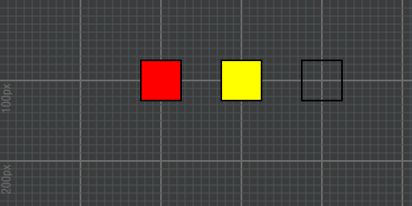

```lua:fill.lua
version3()

move(200, 100, 0)
fill(1, 0, 0)
rect(50)

move(100, 0, 0)
fill(1, 1, 0)
rect(50)

move(100, 0, 0)
noFill()
rect(50)
```

## stroke

1. `stroke()` enables stroke. It is enabled by default.
2. `stroke(brightness)`, `stroke(r, g, b)`, `stroke(r, g, b, a)` enables stroke and sets the stroke color.

## noStroke

`noStroke()` disables the stroke.


```lua:stroke.lua
version3()

fill(0)
move(200, 100, 0)
stroke(1, 0, 0)
rect(50)

move(100, 0, 0)
stroke(1, 1, 0)
rect(50)

move(100, 0, 0)
noStroke()
rect(50)
```

## dot

1. `dot()` enables vertex rendering, which is disabled by default.
2. `dot(brightness)`, `dot(r, g, b)`, `dot(r, g, b, a)` enables vertex rendering and sets the vertex rendering color.

## noDot

`noDot()` disables vertex rendering.


```lua:dot.lua
version3()

fill(1)
move(200, 100, 0)
stroke(1, 0, 0)
rect(50)

move(100, 0, 0)
dot(1, 1, 0)
rect(50)

move(100, 0, 0)
noDot()
rect(50)
```

## wireframe

`wireframe()` enables wireframe mode.

## noWireframe

`noWireframe()` disables wireframe mode.

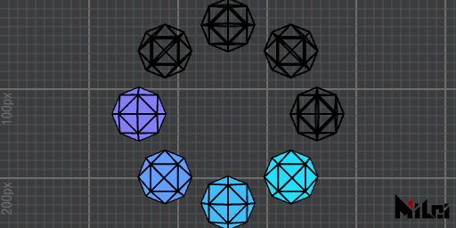

```lua:wireframe.lua
version3()
n = 8
dim3()

move(width/2, height/2)
for i = 1, n do
    if i > n // 2 then wireframe()
    else noWireframe() end
    beginGroup()
    rotateZ(d2r(i * 360 / n))
    move(100, 0, 0)
    fill(i/n, 1-i/n, 1)
    ball(30, 1)
    endGroup()
end
```

## blendAlpha

`blendAlpha()` enables blending mode.

## noBlendAlpha

`noBlendAlpha()` disables blending mode.


```lua:blendAlpha.lua
version3()
castTex(OUTPUT, INPUT)

move(200, 100, 0)
fill(1, 0, 0, 0.2)
rect(80)

move(100, 0, 0)
noBlendAlpha()
fill(1, 0, 0, 0.2)
rect(80)
```

## back

When filled with a transparent color, `back()` displays the backside of the object. Disabled by default.

## noBack

`noBack()` disables backface rendering mode.

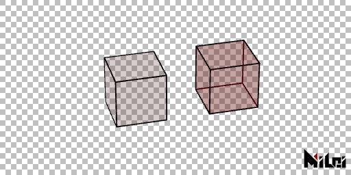

```lua:back.lua
version3()
dim3()
fill(1, 0, 0, 0.2)

rotateX(d2r(30))
rotateY(d2r(-15))
move(200, 180, 0)
cube(80)

move(150, 0, 0)
back()
cube(80)
```

## pure

`pure()` uses pure color mode to render the scene. Enabled by default.

> anime, phong, and pure are three materials that cannot be applied simultaneously. Enabling one will disable the others.

## phong

1. `phong(ambient, diffuse, specular, specularPower)` switches to phong mode and sets the ambient reflection intensity to ambient, diffuse reflection intensity to diffuse, and specular intensity to specular. specularPower determines the specular attenuation level; the larger it is, the faster the specular attenuates.
2. `phong()` switches to phong material mode without changing settings.

> - The default scene has no light sources, so you need to use functions like [getLight()](#getlight), [ambientLight()](#ambientlight), [parallelLight()](#parallellight), or [pointLight](#pointlight) to get light sources.
> - If the rendered object is still pure black under the premise of having light sources, check if normals are correct by calling [normal](#normal).
> - Each parameter's initial value: ambient: 1, diffuse: 1, specular: 1, specularPower: 1.
> - anime, phong, and pure are three materials that cannot be applied simultaneously. Enabling one will disable the others.
> - Execute [dim3()](#dim3) before using.

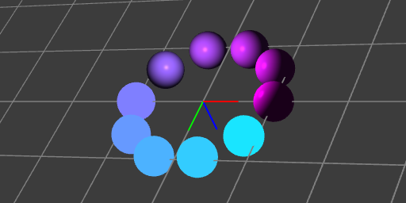

```lua:phong.lua
version3()
dim3()

move(width/2, height/2, 0)

grid()
coord()

n = 10

beginGroup()
move(0, 0, -100)
pointLight()
endGroup()

for i = 1, n do
    beginGroup()
    rotateZ(d2r(i * 360 / n))
    move(100, 0, 0)
    fill(i/n, 1-i/n, 1)
    if(i <= n // 2) then pure()
    else phong() end
    ball(25)
    endGroup()
end
```

## anime

1. `anime(ambient, diffuse, specular, specularPower, diffuseThreshold, specularThreshold)`.
2. `anime()` switches to anime material mode without changing settings.

> - Anime material is developed based on [phong](#phong). Therefore, the first four parameters — ambient, diffuse, specular, and specularPower — are the same as in phong. The remaining two parameters, diffuseThreshold and specularThreshold, set the thresholds for diffuse and specular reflection. When diffuse reflection brightness exceeds the threshold, it is set as a highlight; if it is below, it is set as a shadow. Similarly, specularThreshold sets the threshold for highlights.
> - Anime material has anti-aliasing optimization; if you have anti-aliasing enabled (enabled by default), the light and shadow transition edges will be anti-aliased. Disabling anti-aliasing settings in the plugin panel can turn off edge anti-aliasing.
> - Initial value for each parameter: ambient:1, diffuse:1, specular:1, specularPower:1, diffuseThreshold:0.5, specularThreshold:0.8.
> - Anime, phong, and pure are three materials that cannot be applied simultaneously. Enabling one will disable the others.
> - Execute [dim3()](#dim3) before using.

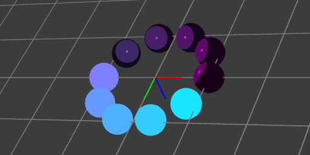

```lua:anime.lua
version3()
dim3()

move(width/2, height/2, 0)

grid()
coord()

n = 10

beginGroup()
move(0, 0, -100)
pointLight()
endGroup()

for i = 1, n do
    beginGroup()
    rotateZ(d2r(i * 360 / n))
    move(100, 0, 0)
    fill(i/n, 1-i/n, 1)
    if(i <= n // 2) then pure()
    else anime() end
    ball(25)
    endGroup()
end
```
## rgba

`rgba()` is the mode for direct RGBA output, enabled by default.

> - rgba, depth, and normal are three modes that cannot be active simultaneously; turning on one will turn off the other two.
> - Materials can be used in this mode.


```lua:rgba.lua
version3()
dim3()
background(1)
move(width/2, height/2, 0)

n = 10

beginGroup()
move(0, 0, -100)
pointLight()
endGroup()

rgba()
-- depth()
-- normal()

noStroke()
for x = 1, n do
    for y = 1, n do
        for z = 1, n do
            beginGroup()
            fill(x/n, y/n, z/n)
            move(map(x, 1, n, -n/2, n/2) * 50, map(y, 1, n, -n/2, n/2) * 50, map(z, 1, n, -n/2, n/2) * 200)
            ball(10, 2)
            endGroup()
        end
    end
end
```

## depth

`depth(blackDistance, whiteDistance)` is a mode that outputs depth as brightness information. For example, to output a depth map, you can specify blackDistance and whiteDistance to set the distance from the camera at which black or white is rendered. A linear interpolation of gray will be done for distances in between. If you set blackDistance and whiteDistance to the same value, the specified value will be used as a threshold to output pure black or pure white.

> - rgba, depth, and normal are three modes that cannot be active simultaneously; turning on one will turn off the others.
> - This mode ignores materials.
> - Execute [dim3()](#dim3) before using.


```lua:depth.lua
version3()
dim3()
background(1)
move(width/2, height/2, 0)

n = 10

beginGroup()
move(0, 0, -100)
pointLight()
endGroup()

-- rgba()
depth()
-- normal()

noStroke()
for x = 1, n do
    for y = 1, n do
        for z = 1, n do
            beginGroup()
            fill(x/n, y/n, z/n)
            move(map(x, 1, n, -n/2, n/2) * 50, map(y, 1, n, -n/2, n/2) * 50, map(z, 1, n, -n/2, n/2) * 200)
            ball(10, 2)
            endGroup()
        end
    end
end
```

## normal

1. `normal(faceToCamera, normalize)` switches to normal mode and modifies faceToCamera and normalize variables.
2. `normal(faceToCamera)` switches to normal mode and only modifies the faceToCamera variable.
3. `normal()` simply switches to normal mode.

> - `faceToCamera` is a boolean value that controls whether normals are generated from the camera's perspective.
> - `normalize` is a boolean value that specifies whether to output normalized normals (length 1).
> - Initial values: faceToCamera: true, normalize: true.
> - rgba, depth, and normal are three modes that cannot be active simultaneously; turning on one will turn off the others.
> - This mode ignores materials.
> - Execute [dim3()](#dim3) before using.


```lua:normal.lua
version3()
dim3()
background(0.5, 0.5, 1)
move(width/2, height/2, 0)

n = 10

beginGroup()
move(0, 0, -100)
pointLight()
endGroup()

-- rgba()
-- depth()
normal()

noStroke()
for x = 1, n do
    for y = 1, n do
        for z = 1, n do
            beginGroup()
            fill(x/n, y/n, z/n)
            move(map(x, 1, n, -n/2, n/2) * 50, map(y, 1, n, -n/2, n/2) * 50, map(z, 1, n, -n/2, n/2) * 200)
            ball(10, 2)
            endGroup()
        end
    end
end
```

## setDepth

`setDepth(id, blackDistance, whiteDistance)` reads the **red channel** of the material on the given id and sets areas with a channel value of 0 to `blackDistance` and areas with a value of 1 to `whiteDistance`, then applies the material to the depth test material.

> - You can import depth sequences rendered from 3D software through this function, allowing PixelsWorld to interact with other layers at different depths.
> - Execute [dim3()](#dim3) before using.
> - Valid ids: `INPUT`, `PARAM0`~`PARAM9`.

## newLight

> A function introduced in `3.7.0`.

`newLight` is responsible for creating a light instance. There are currently three built-in light instances: `ambient light`, `point light`, and `parallel light`.

1. Create an ambient light: `newLight(AMBIENT_LIGHT, r, g, b, intensity)`
2. Create a point light: `newLight(POINT_LIGHT, r, g, b, intensity, x, y, z, radius, smoothWidth)`
3. Create a parallel light: `newLight(PARALLEL_LIGHT, r, g, b, intensity, tx, ty, tz)`

> - `AMBIENT_LIGHT`, `POINT_LIGHT`, `PARALLEL_LIGHT` are constants.
> - `r, g, b` specify the light color, range `0~1`.
> - `intensity` is the light intensity, range `>=0`.
> - `x, y, z` are the coordinates of the point light.
> - `tx, ty, tz` is the directional vector of the parallel light.
> - `radius` is the radius of influence of the point light (see the diagram below).
> - `smoothWidth` is the attenuation distance of the point light (see the diagram below).

> - Return value: A positive integer id representing the light data.

> - Note: This function only creates the light. You also need to call [activateLight](#activatelight) to apply the light to the scene.


## delLight

> A function introduced in `3.7.0`.

`delLight` is used to delete light instances.

1. `delLight(id1)`
2. `delLight(id1, id2)`
3. `delLight(id1, id2, id3)`
4. `...` (Any number of ids can be input)

> - `id` is a positive integer representing light data, obtained from the return value of the [newLight](#newlight) function.
> - Generally, you do not need to delete lights manually. PixelsWorld will automatically clear all lights at the end of each frame.

## getLightInfo

> A function introduced in `3.7.0`.

Use `getLightInfo(id)` to retrieve information about the specified light.

> - For ambient lights, use `type, r, g, b, intensity = getLightInfo(id)` to capture light data.
> - For point lights, use `type, r, g, b, intensity, x, y, z, radius, smoothWidth = getLightInfo(id)` to capture light data.
> - For parallel lights, use `type, r, g, b, intensity, tx, ty, tz = getLightInfo(id)` to capture light data.

If you're unsure of the light type of a given id, you can manage light information as follows:

```lua:getLightInfo.lua
version3()

-- Create three test lights
local lightList = {
    newLight(AMBIENT_LIGHT, 1, 0, 0, 1),
    newLight(POINT_LIGHT, 1, 0, 0, 1, 100, 200, 300, 20, 30),
    newLight(PARALLEL_LIGHT, 1, 0, 0, 1, 100, 200, 300),
}

for i, v in ipairs(lightList) do

    -- Store all return values in an array
    local returnList = {getLightInfo(v)}

    -- Determine light type based on the first return value. (Note: Lua arrays start indexing from 1, not 0)
    if (returnList[1] == AMBIENT_LIGHT) then
        println("Ambient light! Its intensity is: " .. returnList[5])
    elseif (returnList[1] == POINT_LIGHT) then
        println("Point light! Its radius is: " .. returnList[9])
    elseif (returnList[1] == PARALLEL_LIGHT) then
        println("Parallel light! Its x component of direction is: " .. returnList[6])
    end
end

-- Deleting lights is optional
delLight(table.unpack(lightList))
```

## activateLight

> A function introduced in `3.7.0`.

Activates the light and makes it affect the output color of all 3D objects drawn later.

1. `activateLight(id1)`
2. `activateLight(id1, id2)`
3. `activateLight(id1, id2, id3)`
4. `...` (Any number of ids can be input)

> - `id` is a positive integer representing light data, obtained from the return value of the [newLight](#newlight) function.

## deactivateLight

> A function introduced in `3.7.0`.

Deactivates the light, preventing it from affecting the output color of all 3D objects drawn later.

1. `deactivateLight(id1)`
2. `deactivateLight(id1, id2)`
3. `deactivateLight(id1, id2, id3)`
4. `...` (Any number of ids can be input)

> - `id` is a positive integer representing light data, obtained from the return value of the [newLight](#newlight) function.
## getActivatedLight

> A function introduced in `3.7.0`.

Retrieve the ids of all activated lights in the current environment.

1. `getActivatedLight()`

> - Returns: The ids of all lights activated by [activateLight](#activatelight) (the number of return values is 0 or more).
> - If you prefer all return values to be packaged in a list, use `idList = {getActivatedLight()}`.

## setActivatedLight

> A function introduced in `3.7.0`.

Clear all activated lights in the environment and reset activated lights.
1. `setActivatedLight()` clears all lights in the environment.
2. `setActivatedLight(id1)` clears all lights in the environment and activates the light indicated by id1.
3. `setActivatedLight(id1, id2)` clears all lights in the environment and activates the lights indicated by id1 and id2.
4. `...` (Any number of ids can be input)

> - To simply append lights without clearing existing ones, use [activateLight](#activatelight).

## fetchLight

> A function introduced in `3.7.0`.

Fetch light information from an Ae scene with the specified name, create light source instances internally in PixelsWorld based on the fetched parameters, and return the ids of these light instances.

1. `fetchLight(matchName)`
2. `fetchLight()` is equivalent to `fetchLight("*")`

> - matchName rules: If the string does not end with `"*"`, it will search for lights named matchName in the layers of the current Ae composition and add them to the scene; if it ends with `"*"`, all lights starting with matchName will be added to the scene.
> - Currently supported Ae light types: ambient, point, parallel.

> - Returns: One or more ids of light data that match `matchName` (the number of return values is 0 or more).

> - Note: This function only creates light instances. To have the light instances affect the scene, you need to call [activateLight](#activatelight) in combination.

## ambientLight

> Since version `v3.7.0`, this function is not recommended. Please use [newLight](#newlight) instead.

1. `ambientLight(r, g, b, intensity)`
2. `ambientLight()` is equivalent to `ambientLight(1, 1, 1, 1)`
3. `ambientLight(brightness)` is equivalent to `ambientLight(brightness, brightness, brightness, 1)`
4. `ambientLight(brightness, intensity)` is equivalent to `ambientLight(brightness, brightness, brightness, intensity)`
5. `ambientLight(r, g, b)` is equivalent to `ambientLight(r, g, b, 1)`

> - Creates an ambient light effective for all objects in the scene.
> - This light ignores the direction of object normals; it can illuminate objects even if the normals are facing the opposite direction.


```lua:al.lua
version3()
dim3()
move(width/2, height/2, 0)

n = 4

phong()

ambientLight(1, 0.5, 0.2, 10)

noStroke()

for r = 1, n do
    local ra = r * 50
    local cn = math.floor(ra * TPI / 40)
    for i = 1, cn do
        beginGroup()
        rotateZ(d2r(i/cn*360))
        fill(hsl2rgb(i/cn, 0.5, 0.5))
        move(ra, 0, 0)
        ball(15, 3)
        endGroup()
    end
end
```

## pointLight

> Since version `v3.7.0`, this function is not recommended. Please use [newLight](#newlight) instead.


1. `pointLight(r, g, b, intensity, radius, smoothWidth)`
2. `pointLight()` is equivalent to `pointLight(1, 1, 1, 1, 1000, 1000)`
3. `pointLight(brightness, intensity)` is equivalent to `pointLight(brightness, brightness, brightness, intensity, 1000, 1000)`
4. `pointLight(r, g, b)` is equivalent to `pointLight(r, g, b, 1, 1000, 1000)`
5. `pointLight(r, g, b, intensity)` is equivalent to `pointLight(r, g, b, intensity, 1000, 1000)`
6. `pointLight(r, g, b, intensity, radiusAndSmoothWidth)` is equivalent to `pointLight(r, g, b, intensity, radiusAndSmoothWidth, radiusAndSmoothWidth)`

> - Creates a point light source at the current drawing Paintbrush coordinate origin.
> - This light is affected by the direction of object normals; objects with normals facing away will not produce diffuse reflection and highlights but can still receive ambient light from point sources.
> - `radius` denotes the illumination radius; light intensity decreases from `radius` to `radius+smoothWidth`.


```lua:pl.lua
version3()
dim3()
move(width/2, height/2, 0)

n = 4

phong()

ambientLight(0.2, 0.5, 1, 2)

beginGroup()
move(0, 0, -100)
pointLight(1, 0.5, 0.2, 2, 500, 100)
endGroup()

noStroke()

for r = 1, n do
    local ra = r * 50
    local cn = math.floor(ra * TPI / 40)
    for i = 1, cn do
        beginGroup()
        rotateZ(d2r(i/cn*360))
        fill(hsl2rgb(i/cn, 0.5, 0.5))
        move(ra, 0, 0)
        ball(15, 3)
        endGroup()
    end
end
```

## parallelLight

> Since version `v3.7.0`, this function is not recommended. Please use [newLight](#newlight) instead.

1. `parallelLight(r, g, b, intensity, tx, ty, tz)`

> - Generates a parallel light globally with a direction of `(tx, ty, tz)`.


```lua:pll.lua
version3()
dim3()
move(width/2, height/2, 0)

n = 4

phong()

ambientLight(0.2, 0.5, 1, 2)
parallelLight(1, 0.5, 0.2, 2, 1, -1, 1)
noStroke()

for r = 1, n do
    local ra = r * 50
    local cn = math.floor(ra * TPI / 40)
    for i = 1, cn do
        beginGroup()
        rotateZ(d2r(i/cn*360))
        fill(hsl2rgb(i/cn, 0.5, 0.5))
        move(ra, 0, 0)
        ball(15, 3)
        endGroup()
    end
end
```

---

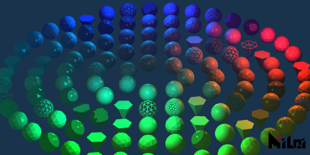

```lua:light_effects.lua
version3()
dim3()
background(0.1, 0.2, 0.3)
move(width/2, height/2, 0)
math.randomseed(1)
n = 5

ambientLight(0.2, 0.5, 1, 1)
parallelLight(1, 0.5, 0.2, 0.1, 1, -1, 1)

beginGroup()
move(200, 0, -100)
pointLight(1, 0.5, 0.2, 1, 200, 100)
endGroup()

beginGroup()
move(-30, 200, -100)
pointLight(0, 1, 1, 1, 200, 100)
endGroup()

beginGroup()
move(-30, -200, -100)
pointLight(0, 1, 1, 1, 200, 100)
endGroup()

noStroke()

for r = 1, n do
    local ra = r * 50
    local cn = math.floor(ra * TPI / 40)
    for i = 1, cn do
        beginGroup()
        rotateZ(d2r(i/cn*360))
        fill(hsl2rgb(i/cn, r/n, 0.6))
        move(ra, 0, 0)

        if math.random() < .15 then
            wireframe()
        else noWireframe() end

        if math.random() < .15 then 
            anime()
        else phong() end

        if math.random() < .8 then
            if math.random() < .3 then 
                ball(15, 3)
            else ball(15, 2) end
        else cone(15, 30, 6) end

        endGroup()
    end
end
```

## clearLight

> Since version `v3.7.0`, this function is not recommended. Consider using [deactivateLight](#deactivateLight), [delLight](#dellight), or [setActivatedLight](#setactivatedlight) instead.

`clearLight()` clears all lights in the scene.

## getLight

> Since version `v3.7.0`, this function is not recommended. Use a combination of [fetchLight](#fetchlight) and [activateLight](#activatelight) instead.

1. `getLight(matchName)`
2. `getLight()` is equivalent to `getLight("*")`

> - Retrieves lights in the current composition that match the matchName.
> - matchName rules: If the string does not end with `"*"`, it searches for lights named matchName in the layers of the current Ae composition and adds them to the scene. If it ends with `"*"`, all lights starting with matchName are added to the scene.
> - Currently supported Ae light types: ambient, point, parallel.

## aeCamera

`aeCamera()` uses the current scene camera from Ae as the camera for the PixelsWorld scene.
## lookAt

1. `lookAt(eyePosX, eyePosY, eyePosZ, objPosX, objPosY, objPosZ, upVecX, upVecY, upVecZ)` sets the camera position and orientation.
2. `lookAt(eyePosX, eyePosY, eyePosZ, objPosX, objPosY, objPosZ)` is equivalent to `lookAt(eyePosX, eyePosY, eyePosZ, objPosX, objPosY, objPosZ, 0, -1, 0)`

> - `eyePos` is your eye's position, `objPos` is the position of the object you want to look at, and `upVec` is the direction pointing from the top of your head.
> - Note that the Y-axis in Ae default points downward, so you generally need `upVec` to be (0, -1, 0).
> - `eyePos` and `objPos` should not be too close (recommended distance is no less than `1e-7`).
> - `upVec` should not be parallel to your line of sight.
> - `upVec` length should not be too small.

## viewSpace


1. `viewSpace(width, height, distanceToPlane, farLevel)`
2. `viewSpace(width, height, distanceToPlane)` is equivalent to `viewSpace(width, height, distanceToPlane, 4)`

> - `width` and `height` are the dimensions of the camera's far plane.
> - The perpendicular distance from the camera to the camera's far plane is `distanceToPlane`.
> - `farLevel * distanceToPlane` is the distance to the farthest plane; objects beyond this distance will not be rendered. Typically, setting `farLevel` to 4 is sufficient. If your scene is very large, this value can be set higher, which only affects whether distant objects are rendered. Setting this value too high might affect the depth testing precision of nearby objects.

## strokeWidth

`strokeWidth(width)` sets the thickness of the stroke.
> Default value: 2


```lua:strokeWidth.lua
version3()
background(1)
move(100, 100)
for i = 1, 30 do
    move(10, 0)
    strokeWidth(i/8)
    line(0, 0, 0, 100)
end
```

## strokeDivision

`strokeDivision(level)` sets the subdivision level of the stroke.
> Default value: 3


```lua:strokeDivision.lua
version3()
background(1)
strokeWidth(30)
move(100, 100)
for i = 0, 3 do
    strokeDivision(i)
    line(0, 0, 0, 100)
    move(75, 0)
end
```

## strokeGlobal

`strokeGlobal()` draws lines in global mode, with line thickness unaffected by scale.
> - Default is local mode


```lua:strokeGlobal.lua
version3()

strokeWidth(4)
strokeGlobal()

move(50, 100)

beginGroup()
for i = 1, 13 do
    beginGroup()
    scale(1/i)
    rect(50)
    endGroup()
    move(50/i + 20, 0)
end
endGroup()
```

## strokeLocal

`strokeLocal()` draws lines in local mode, with line thickness affected by scale.
> - Default is local mode


```lua:strokeLocal.lua
version3()

strokeWidth(4)
strokeLocal()

move(50, 100)

beginGroup()
for i = 1, 13 do
    beginGroup()
    scale(1/i)
    rect(50)
    endGroup()
    move(50/i + 20, 0)
end
endGroup()
```

## dotRadius

`dotRadius(radius)` sets the thickness of the dot.
> - Default value: 2


```lua:dotRadius.lua
version3()
background(1)
fill(0, 1, 1)
dot(1, 0, 0)
move(100, 100)
for i = 1, 7 do
    dotRadius(i/2)
    rect(40)
    move(50, 0)
end
```

## dotDivision

`dotDivision(level)` sets the subdivision level of the dot (non-negative integer, maximum 7).
> - Default value: 3


```lua:dotDivision.lua
version3()
background(1)
fill(0, 1, 1)
dot(1, 0, 0)
dotRadius(10)
move(100, 100)
for i = 0, 4 do
    dotDivision(i)
    rect(40)
    move(70, 0)
end
```

## dotGlobal

`dotGlobal()` draws dots in global mode, with dot radius unaffected by scale.
> - Default is local mode


```lua:dotGlobal.lua
version3()

dot(1, 0, 0)
dotGlobal()

move(50, 100)

beginGroup()
for i = 1, 13 do
    beginGroup()
    scale(1/i)
    rect(50)
    endGroup()
    move(50/i + 20, 0)
end
endGroup()
```

## dotLocal

`dotLocal()` draws dots in local mode, with dot radius affected by scale.
> - Default is local mode


```lua:dotLocal.lua
version3()

dot(1, 0, 0)
dotLocal()

move(50, 100)

beginGroup()
for i = 1, 13 do
    beginGroup()
    scale(1/i)
    rect(50)
    endGroup()
    move(50/i + 20, 0)
end
endGroup()
```

## smooth

`smooth()` draws with anti-aliasing mode.
> Default is on.
> The anti-aliasing strength can be adjusted in the plugin panel.

## noSmooth

`noSmooth()` draws without anti-aliasing mode.
> This function takes precedence over anti-aliasing settings in the plugin panel.

## r2d

`r2d(radians)` converts radians to degrees, returning the degree value.

## d2r

`d2r(degrees)` converts degrees to radians, returning the radian value.

## map

`map(value, in1, in2, out1, out2)` maps the value `value` from the range `in1~in2` to `out1~out2`.

> When `in1` equals `in2`, the function returns `out1` if `value < in1`, otherwise it returns `out2`.

## clamp

`clamp(value, lower, upper)` clamps the value `value` within the range `[lower, upper]`, returning the clamped value.

> - New function in `v3.2.0`.
> - That is, when `value` is between `lower` and `upper`, it returns `value`; if `value` is less than `lower`, it returns `lower`; if `value` is greater than `upper`, it returns `upper`.

## step

`step(value, threshold)` returns 0 when `value < threshold`, otherwise returns 1.

> - New function in `v3.2.0`.
## smoothStep

`smoothStep(value, lower, upper)` returns 0 when `value < lower`, 1 when `value > upper`, and performs smooth interpolation between `lower` and `upper` based on `value`.

Interpolation formula:

$$
t := \frac{x - lower}{upper - lower}
$$

$$
Result := t^2(3 - 2t)
$$

> - New function in `v3.2.0`.

## bezier

`bezier(t, p0, p1, ..., pn)` performs `n`-th order Bezier interpolation on `p0, p1, ..., pn`, returning the interpolated result.

Interpolation formula:

$$
Result := \sum_{k=0}^n{C_n^k \cdot (1-t)^{n-k} \cdot t^k \cdot p_k}
$$

$$
C_n^k := \frac{n!}{(n-k)!k!}
$$

> - New function in `v3.2.0`.
> - The maximum value of `n` is `66`.

## Color Conversion

`xxx2xxx` allows conversions as shown in the diagram below:


For example, if you want to convert color data from `hsl` format to `rgb`, use the function: `hsl2rgb`, with three input values and three return values.

All color data is converted within the range `0~1`.

> - New function in `v3.2.0`.


```lua:color_convert.lua
version3()

dim3()
strokeWidth(0.5)
stroke(0)

move(width/2, height/2, 0)
for x = -5, 5 do
    for y = -5, 5 do
        for z = -5, 5 do
            beginGroup()
            move(x*15, y*15, z*15)
            fill(cmy2rgb(x/10 + 0.5, y/10 + 0.5, z/10 + 0.5))
            cube(12)
            endGroup()
        end
    end
end
```

## utf8ToLocal

`utf8ToLocal(str)` converts a unicode string to a local string, returning the locally encoded string.

> If you're using Lua's `io` module and encounter a path with utf8 characters that cannot be read, use this function to convert the path encoding.

## localToUtf8

`localToUtf8(str)` converts a local string to a unicode string, returning the unicode encoded string.

## getGLInfo

`getGLInfo()` retrieves information about the current graphics card. Returns a string.

## getDrawRecord

1. `getDrawRecord(needStringFormat)` outputs the drawing record information of the current scene. `needStringFormat` is a Boolean value; if true, it outputs a string, if false, it outputs a Lua table.
2. `getDrawRecord()` is equivalent to `getDrawRecord(true)`.

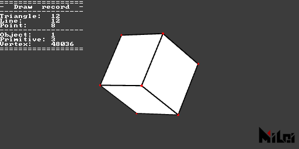

```lua:printDrawRecord.lua
version3()
dot(1, 0, 0)
move(width/2, height/2)
dim3()
cube()
println(getDrawRecord())
```

## getStatus

1. `getStatus(needStringFormat)` can output the current draw status information. `needStringFormat` is a Boolean value; if true, it outputs a string, if false, it outputs a Lua table.
2. `getStatus()` is equivalent to `getStatus(true)`.

```lua:getStatus.lua
version3()
move(width/2, height/2)
dim3()
cube()
println(getStatus())
```

## getAudio

> Ensure you have `v3.4.0+` version of PixelsWorld.

1. `getAudio([startTime, duration[, id[, sampleRate, startFrequency, endFrequency[, resolution]]]])` retrieves audio information, returning six tables: two waveform sampling tables (left and right channels), two FFT result tables (left and right channels), and two spectrum tables (left and right channels).
2. Omitted fields will be filled with audio setting data from the plugin panel.

> - Left channel waveform (-1~1)
> - Right channel waveform (-1~1)
> - Left channel FFT (0~positive infinity)
> - Right channel FFT (0~positive infinity)
> - Left channel spectrum (0~positive infinity)
> - Right channel spectrum (0~positive infinity)

```lua:waveInfo.lua
version3()
castTex(OUTPUT,INPUT)

local wl, wr, ftl, ftr, specl, specr = getAudio()

local nm = math.floor(height/8);

for i = 1, nm do
    local wid = math.max(math.floor(i/nm * #wl), 1)
    local fid = math.max(math.floor(i/nm * #specl), 1)
    print(string.format("%8.5f", wl[wid]), wl[wid] * 4, 0, -wl[wid] * 4)
    print("  < L  R >  ", 1, 0, 0, 0)
    print(string.format("%8.5f", wr[wid]), wr[wid] * 4, 0, -wr[wid] * 4)
    print("      <   Wave  FFT   >      ", 0.5, 0.5, 0.5)
    print(string.format("%8.5f", specl[fid]), specl[fid], 0, 0)
    print("  < L  R >  ", 1, 0, 0, 0)
    print(string.format("%8.5f", specr[fid]), 0, 0, specr[fid])
    println("")
end
```

## saveString

`saveString(utf8_path, string)` saves a string as a text format in the local system.

## loadString

`loadString(utf8_path)` reads a local text file, returning the string.

## getColor

`getColor(id, x, y)` returns the pixel value at coordinate (x, y) of the texture `id`, with r, g, b, a as four double-precision floating-point numbers.
`getColor(x, y)` is equivalent to `getColor(INPUT, x, y)`.

> - When `getColor` is used before drawing any scene (i.e., immediately after `version3()`), the function is most efficient. Using `getColor` during scene drawing is very inefficient as Lua operates on the CPU, and all textures are sent to your graphics card during drawing, making communication between the GPU and CPU costly.
> - Valid ids are `INPUT`, `OUTPUT`, `PARAM0` ~ `PARAM9`.

## setColor

`setColor(x, y, r, g, b, a)` sets the pixel value at coordinate (x, y) of the `OUTPUT` texture.

> - Efficiency is highest when using `setColor` before drawing any scene (i.e., immediately after `version3()`).

## getSize

`getSize(id)` returns the size of the texture `id` (two doubles, width, and height).

> When you change scene downsample (e.g., half, quarter), the returned size may jitter by 0~4 pixels due to Ae’s downsampling feature. However, this jitter does not change over time. When downsampling is turned off, this function guarantees the correct layer size.

## shadertoy

`shadertoy(code)` executes code from Shadertoy.

> - Not all Shadertoy code is supported.

## glsl

`glsl(code)` executes Fragment stage code.

## cmd

`cmd(code)` executes a cmd command.

> If the command runs successfully, the first return value is true; otherwise, it is nil. After the first return value, the function returns a string and a number. As follows:
> - "exit": The command ended normally; the following number is the command’s exit status code.
> - "signal": The command was interrupted by a signal; the next number is the signal that interrupted the command.

## lua

`lua(code)` executes Lua code.

## runFile

`runFile(utf8_path)` reads a local file as a txt file and executes it as Lua code.

> Supports utf8 by default, so no need to call `utf8ToLocal` for conversion.

## txt

`txt(utf8_path)` reads a local file as a txt file and returns a string.

> Supports utf8 by default, so no need to call `utf8ToLocal` for conversion.