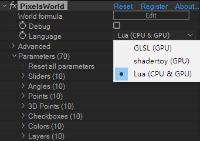

#JavaScript Code
---
Javascript can be executed by function ```js("Your code")``` on **Lua (CPU & GPU)** language mode. 





```lua:executeJS.lua
version3()
js("alert('Hello PixelsWorld!')");
```

> Note: Due to the structure of Ae, running js code inside PixelsWorld is not recommended. You are supposed to use js to do some simple calculations basing on local variables. 