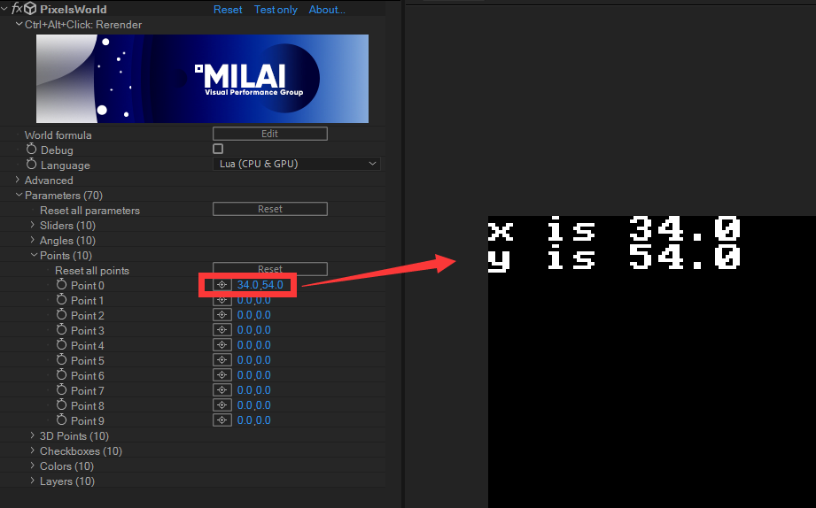

#Link parameters
---


```lua:parameters.lua
slider(id)  -- return 1 double
angle(id)  -- return 1 double
point(id)  -- return 2 double
point3d(id) -- return 3 double
checkbox(id) -- return 1 boolean
color(id) -- return 3 double
layer(id,x,y) -- return 4 double
```

If there are more than one values returned, the corresponding number of variables need be declared to catch the values. For instance, the `point()` function: 

```lua:point.lua
version3()
x,y = point(0) -- Declear two variables x and y
println('x is ' .. x)
println('y is ' .. y)
```

