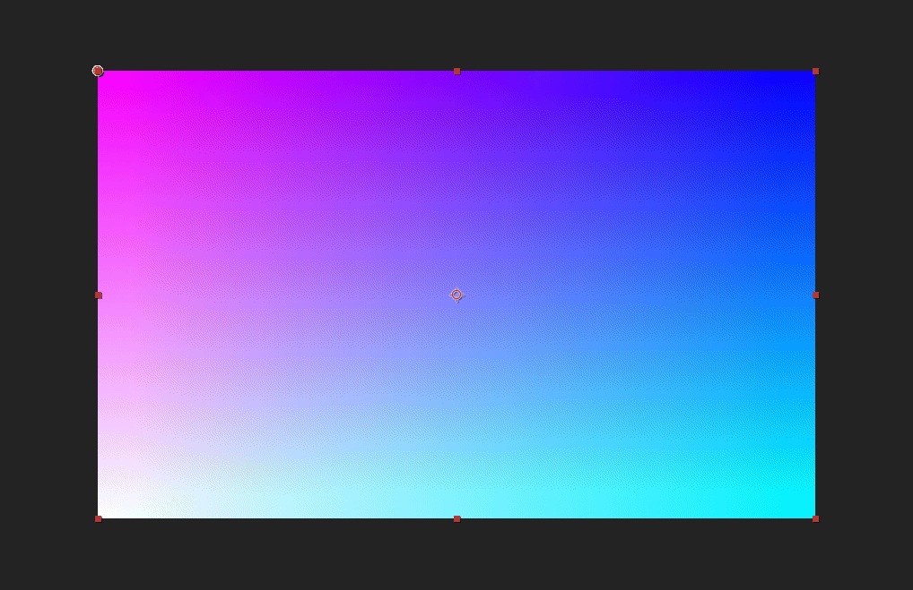

#Run GLSL in Lua
---

##Usage
###pw.glsl(GLSLcode[, useBuffer])
- GLSLcode: string, the source fragment code. If your input code can be run in **GLSL Render Mode**, it can be directly used in here. (Codes from shadertoy.com is not supported here.)
- useBuffer : bool, optional, by default, this is set to false. If this is true, PixelsWorld will generate a temp memory to store your render result. When the GLSL render done, these data in temp memory will override the output layer's pixels data. 
<br/><br/>
Case you should set **useBuffer** to true: 
1. You want to re-read pixels from out layer. (Namely, there is ```getColor(OUTPUT_LAYER_INDEX,uv)``` in your glsl code)
2. You want to make render slow. 
> If you render glsl only one time each frame, you can totally ignore this option. 


Here are some code to describe the useBuffer : 
> Tips:<br/>
> Use `[==[` and `]==]` to enclose the multi-line code.

```lua:useBuffer_on.lua
pw.glsl(
    [==[
        void main(){
            outColor = vec4(uv,0,1);
        }
    ]==]
)

pw.glsl(
    [==[
        void main(){
            vec3 outlayerColor = getColor(OUTPUT_LAYER_INDEX,uv).rgb;
            outColor = vec4(vec3(1)-outlayerColor,1);
        }
    ]==],true
)
```

```lua:useBuffer_off.lua
pw.glsl(
    [==[
        void main(){
            outColor = vec4(uv,0,1);
        }
    ]==]
)

pw.glsl(
    [==[
        void main(){
            vec3 outlayerColor = getColor(OUTPUT_LAYER_INDEX,uv).rgb;
            outColor = vec4(vec3(1)-outlayerColor,1);
        }
    ]==],false
)
```

