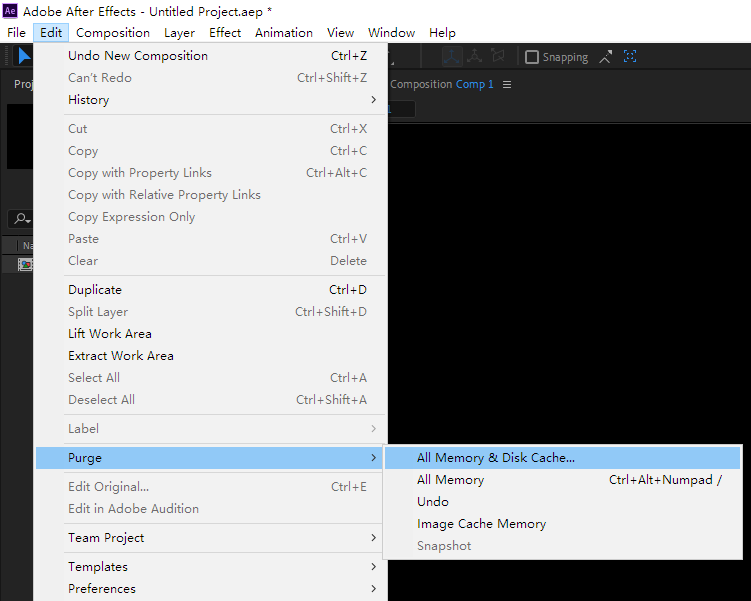

# Physics simulation
---

> The following gif is result of  [Chimera's Breath -by nimitz](https://www.shadertoy.com/view/4tGfDW) running in PixelsWorld. [See full resolution video](https://youtu.be/OvohYJbnOvE)


You will learn how to cache data to local disc in this section. 

<span style="color:red">Note: This manual should be strictly followed for caching data in a right way</span>

> - Make sure you have updated PixelsWorld to `v3.3.3+`
> - This section is written in a style that assumed the readers are familiar with Ae and PixelsWorld. 

<!-- no toc --> 
- [Cache data](#cache-data)
- [Cache textures](#cache-textures)
- [Cache data example: The three body problem](#cache-data-example-the-three-body-problem)
- [Cache textures example: Conway's Game of Life](#cache-textures-example-conways-game-of-life)
- [Cache textures example: Fluid simulation](#cache-textures-example-fluid-simulation)


## Cache data

To cache data, the following steps should be followed: 

Code logic: 
1. Set cache path and cache name
2. Caculate `frameId=time*fps`
3. Caculate `lastFrameId=frameId-1`
4. If `lastFrameId` < 0, go to 5, otherwise, go to 6
5. Initialize data, go to 7
6. Read data file saved by last frame, throw error if file not exists, go to 7 otherwise. 
7. Calculate data
8. Save current data file to local. 

Operating logic: 
1. Put code satisfies above logic to PixelsWorld. 
2. Put the Time indicator to the first frame of current layer. 
3. Purge Ae cache(`Edit->Purge->All Memory & Disk Cache...` see the screenshot below)
4. Hold `Ctrl+Alt` and click the LOGO image in plugin panel. (This step is optional)
5. Press Space key to render(**DON'T skip frames while rendering**)

> Note: If something goes wrong (errors, flickers, etc.), redo step 2~5. 




## Cache textures


Code logic: 
1. If downsampled(1/2, 1/4 render mode), throw error. 
1. Set cache path and cache name
2. Caculate `frameId=time*fps`
3. Caculate `lastFrameId=frameId-1`
4. If `lastFrameId` < 0, go to 5, otherwise, go to 6
5. Initialize texture, go to 7
6. Read texture file saved by last frame, throw error if file not exists, go to 7 otherwise. 
7. Render texture file
8. Save current texture file to local. 

> See [Texture](./Texture.md) section to learn how to work with texture. 

Operating logic: 
1. Put code satisfies above logic to PixelsWorld. 
2. Change PixelsWorld settings `Advanced->Internal texture format` to `Floating point 32bit x RGBA (HDR)`
3. Put the Time indicator to the first frame of current layer. 
4. Purge Ae cache(`Edit->Purge->All Memory & Disk Cache...` see the screenshot below)
5. Hold `Ctrl+Alt` and click the LOGO image in plugin panel. (This step is optional)
6. Press Space key to render(**DON'T skip frames while rendering**)


## Cache data example: The three-body problem


```lua:the_three_body_problem.lua
version3()


-- Include vector library
require("veclib") 


-- Set cache file name
local cacheFileName = "A" 


-- Add checking if file exists function(Refer: https://stackoverflow.com/questions/4990990/check-if-a-file-exists-with-lua) 
function file_exists(name)
    local f=io.open(name,"r")
    if f~=nil then io.close(f) return true else return false end
end


-- Calculate current frame index then round it to integer. 
local frameId = math.floor(time * fps + .5)


-- Calculate last frame index 
local lastFrameId = frameId -1


-- Frame id should not be negative. 
assert(frameId >= 0, "FrameId not support")
-- Print it out. (This line can be removed)
println("Frame ID: " .. frameId)


-- Set cache folder. (Here I used the aep project folder, don't forget to save your project before use projectFolder)
local cachePath = projectFolder .. "cache\\"
-- Print it out. (This line can be removed)
println("Cache path: " .. cachePath)


-- If frameId == 0 (Namely lastFrameId < 0)
if(lastFrameId < 0) then
    -- Initialze the position and velocity of 3 planets
    p1 = vec3(100,0,0)
    v1 = vec3(-0.1,-0.1,-0.5)
    p2 = vec3(0,-100,0)
    v2 = vec3(0,0.1,0)
    p3 = vec3(-100,0,-95)
    v3 = vec3(0.1,0,0.5)
else
    -- Check if last frame data exists. 
    if(file_exists(cachePath .. cacheFileName .. "_" .. tostring(lastFrameId) .. ".txt")) then
        -- Read last frame data. 
        lua(loadString(cachePath .. cacheFileName .. "_" .. tostring(lastFrameId) .. ".txt"))
    else 
        -- Throw error when not exists
        error("Please go back to frame 0 to re-cache your comp")
    end
end

-- Start calculation (simulation)
center = vec3(width/2,height/2,0)

f1,f2,f3 = vec3(0),vec3(0),vec3(0)
r = 15

m1=8
m2=10
m3=5

dp12,dp13,dp23 = p1-p2,p1-p3,p2-p3

f1 = f1 + m1*m2/math.max(dot(dp12,dp12),1e-1) * (-dp12)
f2 = f2 + m1*m2/math.max(dot(dp12,dp12),1e-1) * (dp12)

f1 = f1 + m1*m3/math.max(dot(dp13,dp13),1e-1) * (-dp13)
f3 = f3 + m1*m3/math.max(dot(dp13,dp13),1e-1) * (dp13)

f2 = f2 + m3*m2/math.max(dot(dp23,dp23),1e-1) * (-dp23)
f3 = f3 + m3*m2/math.max(dot(dp23,dp23),1e-1) * (dp23)


v1 = v1 + f1*(1/m1)
p1 = p1 + v1

v2 = v2 + f2*(1/m2)
p2 = p2 + v2

v3 = v3 + f3*(1/m3)
p3 = p3 + v3

-- End simulation


-- Save position and velocity to local
saveString(
    cachePath .. cacheFileName .. "_" .. tostring(frameId) .. ".txt",
    string.format([==[
        p1=vec3(%f,%f,%f);v1=vec3(%f,%f,%f);
        p2=vec3(%f,%f,%f);v2=vec3(%f,%f,%f);
        p3=vec3(%f,%f,%f);v3=vec3(%f,%f,%f);
        ]==],
        p1.x,p1.y,p1.z,v1.x,v1.y,v1.z,
        p2.x,p2.y,p2.z,v2.x,v2.y,v2.z,
        p3.x,p3.y,p3.z,v3.x,v3.y,v3.z
    )
)


-- Draw three planets with simulation data. 
dim3()

move(center.x,center.y,center.z)

-- Draw coordinate and grid. 
coord()
grid()

-- 1st planet
beginGroup()
move(p1.x,p1.y,p1.z)
fill(1,0,1)
ball(r)
endGroup()

-- 2nd planet
beginGroup()
fill(1,1,0)
move(p2.x,p2.y,p2.z)
ball(r)
endGroup()

-- 3rd planet
beginGroup()
fill(0,1,1)
move(p3.x,p3.y,p3.z)
ball(r)
endGroup()
```


## Cache textures example: Conway's Game of Life


```lua:game_of_life.lua
version3()

-- Check downsample settings. 
assert(width == ds_width and height == ds_height , "Downsample not support" )


-- Add checking if file exists function(Refer: https://stackoverflow.com/questions/4990990/check-if-a-file-exists-with-lua) 
function file_exists(name)
    local f=io.open(name,"r")
    if f~=nil then io.close(f) return true else return false end
 end


-- Calculate current frame index then round it to integer. 
local frameId = math.floor(time * fps + .5)


-- Calculate last frame index 
local lastFrameId = frameId -1


-- Frame id should not be negative. 
assert(frameId >= 0, "FrameId not support")
-- Print it out. (This line can be removed)
println("Frame ID: " .. frameId)


-- Set cache folder.
local cachePath = projectFolder .. "cache\\"
-- Print it out. (This line can be removed)
println("Cache path: " .. cachePath)


-- Check if it is frame 0
if(lastFrameId < 0) then
    -- Initialize texture
    lastTexA = newTex(width,height)
else
    -- Check if last frame texture exists
    if(file_exists(cachePath .. "A_" .. tostring(lastFrameId) .. ".raw")) then
        -- Load last frame texture
        lastTexA = loadRAW(cachePath .. "A_" .. tostring(lastFrameId) .. ".raw")
    else 
        error("Please go back to frame 0 to cache your comp")
    end
end


-- Set render code
local fragCode = [==[
// Definition from: https://en.wikipedia.org/wiki/Conway%27s_Game_of_Life
// MIT license (Free for study and business purpose)
// Code by ZzStarSound

const int dx[8] = int[](-1,0,1,1,1,0,-1,-1);
const int dy[8] = int[](1,1,1,0,-1,-1,-1,0);

bool fetchStatus(int ox, int oy)
{
    ivec2 iuv = ivec2(floor(uv*resolution.xy)) + ivec2(ox,oy);
    ivec2 res = ivec2(floor(resolution.xy));
    if(iuv.x >= res.x || iuv.x < 0 || iuv.y >=res.y || iuv.y<0) return false;
    return texelFetch(layer[0],iuv,0).x>.5;
}

// From https://thebookofshaders.com/10/
float random (vec2 st) {
    return fract(sin(dot(st.xy, vec2(12.9898,78.233)))* 43758.5453123);
}

void main(){
    if(time == 0.)
    {
        outColor = vec4(random(uv)>.5);
    }else{
        bool curstatus = fetchStatus(0,0);
        int roundCount = 0;
        for(int i = 0;i<8;i++){
            if(fetchStatus(dx[i],dy[i])) roundCount ++ ;
        }
        if(curstatus)
        {
            if(roundCount < 2 || roundCount > 3) outColor = vec4(0);
            else outColor = vec4(curstatus);
        }
        else
        {
            if(roundCount == 3) outColor = vec4(1);
            else outColor = vec4(0);
        }
    }
}
]==]


-- Put the last frame texture to PARAM0, so that you can read last frame texture via layer[0]
swapTex(PARAM0,lastTexA)


-- Render texture
glsl(fragCode)


-- Put the last frame texture back to its original position. 
swapTex(PARAM0,lastTexA)


-- Save texture to local
saveRAW(cachePath .. "A_" .. tostring(frameId) .. ".raw",OUTPUT)


```


## Cache textures example: Fluid simulation


> - Note: According to the code license declared by [original author](https://www.shadertoy.com/view/4tGfDW), the following code should only be used for study purpose. 
> - Don't forget to set the `Internal texture format` to `Floating point 32 bit x RGBA (HDR)` in plugin panel. 
> - Setting `Mipmap filter` to `NONE` could speed up render. 

```lua:fluid_simulation.lua
version3()

assert(width == ds_width and height == ds_height , "Downsample not support" )

function file_exists(name)
    local f=io.open(name,"r")
    if f~=nil then io.close(f) return true else return false end
 end

local frameId = math.floor(time * fps + .5)
local lastFrameId = frameId -1

assert(frameId >= 0, "FrameId not support")
println("Frame ID: " .. frameId)
local cachepath = projectFolder .. "cache\\"
println("Cache path: " .. cachepath)


if(lastFrameId < 0) then
    lastTexC = newTex(width,height)
    lastTexD = newTex(width,height)
    drawTo(lastTexC)
    background(0,0,0,1)
    drawTo(lastTexD)
    background(0,0,0,1)
    drawTo(OUTPUT)
else
    if(file_exists(cachepath .. "C.raw") and file_exists(cachepath .. "D.raw") ) then
        lastTexC = loadRAW(cachepath .. "C.raw")
        lastTexD = loadRAW(cachepath .. "D.raw")
    else 
        error("Please go back to frame 0 to cache your comp")
    end
end


local commonCode = [==[
//Chimera's Breath
//by nimitz 2018 (twitter: @stormoid)

/*
	The main interest here is the addition of vorticity confinement with the curl stored in
	the alpha channel of the simulation texture (which was not used in the paper)
	this in turns allows for believable simulation of much lower viscosity fluids.
	Without vorticity confinement, the fluids that can be simulated are much more akin to
	thick oil.
	
	Base Simulation based on the 2011 paper: "Simple and fast fluids"
	(Martin Guay, Fabrice Colin, Richard Egli)
	(https://hal.inria.fr/inria-00596050/document)

	The actual simulation only requires one pass, Buffer A, B and C	are just copies 
	of each other to increase the simulation speed (3 simulation passes per frame)
	and Buffer D is drawing colors on the simulated fluid 
	(could be using particles instead in a real scenario)
*/

#define dt 0.15
#define USE_VORTICITY_CONFINEMENT
//#define MOUSE_ONLY

//Recommended values between 0.03 and 0.2
//higher values simulate lower viscosity fluids (think billowing smoke)
#define VORTICITY_AMOUNT 0.11

float mag2(vec2 p){return dot(p,p);}
vec2 point1(float t) {
    t *= 0.62;
    return vec2(0.12,0.5 + sin(t)*0.2);
}
vec2 point2(float t) {
    t *= 0.62;
    return vec2(0.88,0.5 + cos(t + 1.5708)*0.2);
}

vec4 solveFluid(sampler2D smp, vec2 uv, vec2 w, float time)
{
	const float K = 0.2;
	const float v = 0.55;
    
    vec4 data = textureLod(smp, uv, 0.0);
    vec4 tr = textureLod(smp, uv + vec2(w.x , 0), 0.0);
    vec4 tl = textureLod(smp, uv - vec2(w.x , 0), 0.0);
    vec4 tu = textureLod(smp, uv + vec2(0 , w.y), 0.0);
    vec4 td = textureLod(smp, uv - vec2(0 , w.y), 0.0);
    
    vec3 dx = (tr.xyz - tl.xyz)*0.5;
    vec3 dy = (tu.xyz - td.xyz)*0.5;
    vec2 densDif = vec2(dx.z ,dy.z);
    
    data.z -= dt*dot(vec3(densDif, dx.x + dy.y) ,data.xyz); //density
    vec2 laplacian = tu.xy + td.xy + tr.xy + tl.xy - 4.0*data.xy;
    vec2 viscForce = vec2(v)*laplacian;
    data.xyw = textureLod(smp, uv - dt*data.xy*w, 0.).xyw; //advection
    
    vec2 newForce = vec2(0);

    newForce.xy += 0.75*vec2(.0003, 0.00015)/(mag2(uv-point1(time))+0.0001);
    newForce.xy -= 0.75*vec2(.0003, 0.00015)/(mag2(uv-point2(time))+0.0001);
    
    
    data.xy += dt*(viscForce.xy - K/dt*densDif + newForce); //update velocity
    data.xy = max(vec2(0), abs(data.xy)-1e-4)*sign(data.xy); //linear velocity decay
    
    #ifdef USE_VORTICITY_CONFINEMENT
   	data.w = (tr.y - tl.y - tu.x + td.x);
    vec2 vort = vec2(abs(tu.w) - abs(td.w), abs(tl.w) - abs(tr.w));
    vort *= VORTICITY_AMOUNT/length(vort + 1e-9)*data.w;
    data.xy += vort;
    #endif
    
    data.y *= smoothstep(.5,.48,abs(uv.y-0.5)); //Boundaries
    
    data = clamp(data, vec4(vec2(-10), 0.5 , -10.), vec4(vec2(10), 3.0 , 10.));
    
    return data;
}
]==]

local bufferACode = [==[

    float length2(vec2 p){return dot(p,p);}
    mat2 mm2(in float a){float c = cos(a), s = sin(a);return mat2(c,s,-s,c);}
    
    void mainImage( out vec4 fragColor, in vec2 fragCoord )
    {
        vec2 uv = fragCoord.xy/iResolution.xy;
        vec2 w = 1.0/iResolution.xy;
        
        vec4 data = solveFluid(iChannel0, uv, w, iTime);
        fragColor = data;
        
    }
]==]

local bufferBCode = [==[

    float length2(vec2 p){return dot(p,p);}
    mat2 mm2(in float a){float c = cos(a), s = sin(a);return mat2(c,s,-s,c);}
    
    void mainImage( out vec4 fragColor, in vec2 fragCoord )
    {
        vec2 uv = fragCoord.xy/iResolution.xy;
        vec2 w = 1.0/iResolution.xy;
        
        vec4 data = solveFluid(iChannel0, uv, w, iTime);
        fragColor = data;
        
    }
]==]

local bufferCCode = [==[

    float length2(vec2 p){return dot(p,p);}
    mat2 mm2(in float a){float c = cos(a), s = sin(a);return mat2(c,s,-s,c);}
    
    void mainImage( out vec4 fragColor, in vec2 fragCoord )
    {
        vec2 uv = fragCoord.xy/iResolution.xy;
        vec2 w = 1.0/iResolution.xy;
        
        vec4 data = solveFluid(iChannel0, uv, w, iTime);
        fragColor = data;
        
    }
]==]

local bufferDCode = [==[
    //Chimera's Breath
    //by nimitz 2018 (twitter: @stormoid)
    
    //see "Common" tab for fluid simulation code
    
    mat2 mm2(in float a){float c = cos(a), s = sin(a);return mat2(c,s,-s,c);}
    
    //shader incoming relating to this palette
    vec3 getPalette(float x, vec3 c1, vec3 c2, vec3 p1, vec3 p2)
    {
        float x2 = fract(x/2.0);
        x = fract(x);   
        mat3 m = mat3(c1, p1, c2);
        mat3 m2 = mat3(c2, p2, c1);
        float omx = 1.0-x;
        vec3 pws = vec3(omx*omx, 2.0*omx*x, x*x);
        return clamp(mix(m*pws, m2*pws, step(x2,0.5)),0.,1.);
    }
    
    vec4 pal(float x)
    {
        vec3 pal = getPalette(-x, vec3(0.2, 0.5, .7), vec3(.9, 0.4, 0.1), vec3(1., 1.2, .5), vec3(1., -0.4, -.0));
        return vec4(pal, 1.);
    }
    
    vec4 pal2(float x)
    {
        vec3 pal = getPalette(-x, vec3(0.4, 0.3, .5), vec3(.9, 0.75, 0.4), vec3(.1, .8, 1.3), vec3(1.25, -0.1, .1));
        return vec4(pal, 1.);
    }
    
    void mainImage( out vec4 fragColor, in vec2 fragCoord )
    {
        vec2 uv = fragCoord.xy / iResolution.xy;
        vec2 mo = iMouse.xy / iResolution.xy;
        vec2 w = 1.0/iResolution.xy;
        
        vec2 velo = textureLod(iChannel0, uv, 0.).xy;
        vec4 col = textureLod(iChannel1, uv - dt*velo*w*3., 0.); //advection
    
    
        col += .0025/(0.0005+pow(length(uv - point1(iTime)),1.75))*dt*0.12*pal(iTime*0.05 - .0);
        col += .0025/(0.0005+pow(length(uv - point2(iTime)),1.75))*dt*0.12*pal2(iTime*0.05 + 0.675);
        
        
        if (iFrame < 20)
        {
            col = vec4(0.);
        }
        
        col = clamp(col, 0.,5.);
        col = max(col - (0.0001 + col*0.004)*.5, 0.); //decay
        
    
        fragColor = col;
        
    }
    
]==]

local mainCode = [==[
    void mainImage( out vec4 fragColor, in vec2 fragCoord )
    {
        vec4 col = textureLod(iChannel0, fragCoord/iResolution.xy, 0.);
        fragColor = col;
    }
]==]


local texA,texB,texC=newTex(width,height),newTex(width,height),newTex(width,height),newTex(width,height)

swapTex(PARAM0,lastTexC)
shadertoy(commonCode .. bufferACode)
swapTex(PARAM0,lastTexC)
castTex(texA,OUTPUT)


swapTex(PARAM0,texA)
shadertoy(commonCode .. bufferBCode)
swapTex(PARAM0,texA)
castTex(texB,OUTPUT)

swapTex(PARAM0,texB)
shadertoy(commonCode .. bufferCCode)
swapTex(PARAM0,texB)
castTex(texC,OUTPUT)
saveRAW(cachepath .. "C.raw",texC)

swapTex(PARAM0,texA)
swapTex(PARAM1,lastTexD)
shadertoy(commonCode .. bufferDCode)
swapTex(PARAM0,texA)
swapTex(PARAM1,lastTexD)
saveRAW(cachepath .. "D.raw",OUTPUT)

```
