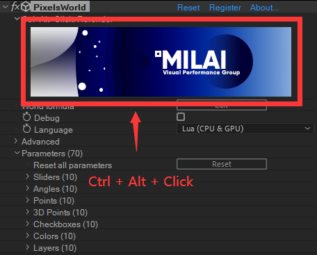

# 在本地写代码

If you don't prefer to use PixelsWorld's editor, PixelsWorld can read `txt` file from local disc. So you can write the file with the IDE you like. 

> Don't put the file to system disc(`C:\` disc). 


```lua:loadTxt.lua
version3()
runFile([[d:\mycode.txt]]) -- Replace to your path
```

> - The reason we use `[[d:\mycode.txt]]` but not `"d:\mycode.txt"` is that the latter's `\` will cause escape problem. 
> - You can use any postfix you want(`*.lua, *.code, *.magic`) as long as its contents are texts. 

Use following code to read the code file beside your Ae project file. 

```lua:loadTxt.lua
version3()
runFile( projectFolder .. [[mycode.txt]]) -- Replace to your file name
```

> Note: You should save your Ae project to local disc or the `projectFolder` is just an empty string. 

## It is not over! Don't forget to refresh PixelsWorld



If you saved your code file, PixelsWorld cannot read it immediatly. You should then hold **Ctrl + Alt**, click the logo image, this will trigger the rerender of PixelsWorld, then your new code will be read by PixelsWorld. 

> The logo image here is appearing basing on a constant probability distribution. For artists who are crazy about collecting things, we have designed lots of beautiful logo image here. 