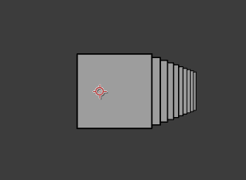
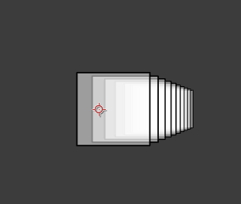

# 透明形状渲染
---
一般在渲染一列半透明立方体时，会得到下面的结果




```lua:normalCubes.lua
version3()
in2out()

dim3()
fill(1,.5)

move(width/2, height/2)

for i = 1,10 do
move(20,0,200)
cube()
end
```

但是这个结果是不对的，我们看不到透明立方体后面的部分。

我们需要根据摄像机从远到近渲染这些立方体，这样才能产生正确的叠色：



```lua:sortCubes.lua
version3()
in2out()

dim3()
fill(1,.5)

sortarr = {}

beginGroup()
move(width/2, height/2)
for i = 1,10 do
move(20,0,200)
local x,y,z = global2screen(local2global(0,0,0)) -- Get camera distance
sortarr[i] = {z,getTransformMatrix()} -- {distance, transform status} pairs
end
endGroup()

table.sort(sortarr,function(a,b) -- Sort by z distance
return a[1] > b[1]
end)

for i = 1,10 do
beginGroup(sortarr[i][2]) -- Apply transform status
cube()
endGroup()
end
```