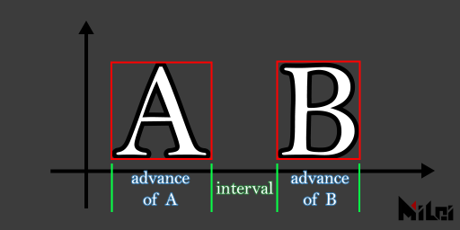
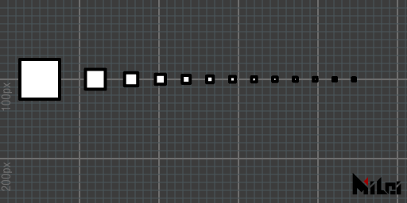
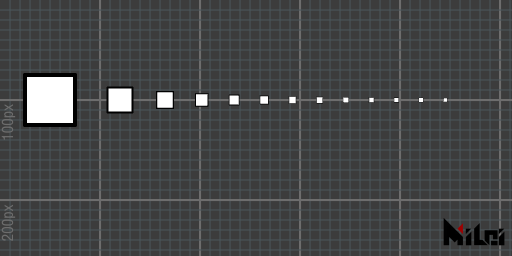

# 関数一覧
---

以下は、PixelsWorldのLuaモードで定義されているすべての関数です。

**必須の宣言関数**

[version3](#version3)

**パラメータ取得関数**

[slider](LinkParameters.md),
[angle](LinkParameters.md),
[point](LinkParameters.md),
[point3d](LinkParameters.md),
[checkbox](LinkParameters.md),
[color](LinkParameters.md),
[layer](LinkParameters.md)

**情報出力関数**

[print](#print),
[println](#println),
[alert](#alert)

**変換関数**

[move](#move),
[scale](#scale),
[rotate](#rotate),
[rotateX](#rotatex),
[rotateY](#rotatey),
[rotateZ](#rotatez),
[twirl](#twirl)

[beginGroup](#begingroup),
[endGroup](#endgroup),
[beginGlobal](#beginglobal),
[endGlobal](#endglobal)

[global2local](#global2local),
[local2global](#local2global),
[global2screen](#global2screen),
[screen2global](#screen2global)

[getTransformMatrix](#gettransformmatrix)

**描画関数**

> 図形

[tri](#tri),
[quad](#quad),
[rect](#rect),
[circle](#circle),
[ellipse](#ellipse),
[par](#par),
[line](#line)

[cube](#cube),
[tet](#tet),
[cone](#cone),
[ball](#ball),
[tube](#tube)

[image](#image),
[imageAlign](#imagealign),
[imageAnchor](#imageanchor)

[text](#text),
[textSize](#textsize),
[textFont](#textfont),
[textAlign](#textalign),
[textAnchor](#textanchor),
[textAlignOuter](#textalignouter),
[textInterval](#textinterval),
[textAdvanceScale](#textadvancescale)

[coord](#coord),
[grid](#grid)

[poly](Poly.md),
[setPoly](#setpoly)

[background](#background),
[in2out](#in2out)

> 描画属性制御

[dim2](#dim2),
[dim3](#dim3)

[perspective](#perspective),
[noPerspective](#noperspective)

[fill](#fill),
[noFill](#nofill),
[stroke](#stroke),
[noStroke](#nostroke),
[dot](#dot),
[noDot](#nodot)

[wireframe](#wireframe),
[noWireframe](#nowireframe)

[blendAlpha](#blendalpha),
[noBlendAlpha](#noblendalpha)

[back](#back),
[noBack](#noback)

[pure](#pure),
[phong](#phong),
[anime](#anime)

[rgba](#rgba),
[depth](#depth),
[normal](#normal)

[setDepth](#setdepth)

> ライト

[newLight](#newlight),
[delLight](#dellight),
[getLightInfo](#getlightinfo)

[activateLight](#activatelight),
[deactivateLight](#deactivatelight),
[getActivatedLight](#getactivatedlight),
[setActivatedLight](#setactivatedlight)

[fetchLight](#fetchlight)

[ambientLight (legacy)](#ambientlight),
[pointLight (legacy)](#pointlight),
[parallelLight (legacy)](#parallellight)

[clearLight (legacy)](#clearlight),
[getLight (legacy)](#getlight)

> カメラ

[aeCamera](#aecamera),
[lookAt](#lookat),
[viewSpace](#viewspace)

> ストロークの詳細

[strokeWidth](#strokewidth),
[strokeDivision](#strokedivision),
[strokeGlobal](#strokeglobal),
[strokeLocal](#strokelocal)

> 点描画の詳細

[dotRadius](#dotradius),
[dotDivision](#dotdivision),
[dotGlobal](#dotglobal),
[dotLocal](#dotlocal)

> 出力の詳細

[smooth](#smooth),
[noSmooth](#nosmooth)

**テクスチャ操作**

[newTex, delTex, getSize, swapTex, drawTo, castTex, blendTex, copyTex, savePNG, loadPNG, saveEXR, loadEXR, rotateTex, flipTex, resizeTex, trimTex](Texture.md)

**ツール**

[r2d](#r2d),
[d2r](#d2r)

[map](#map)
[clamp](#clamp)
[step](#step)
[smoothStep](#smoothstep)
[bezier](#bezier)

[rgb2hsl,hsl2rgb,rgb2hsv,hsv2rgb,rgb2cmy,cmy2rgb,rgb2cmyk,cmyk2rgb,cmy2cmyk,cmyk2cmy,hsl2hsv,hsv2hsl](#カラー変換)

[utf8ToLocal](#utf8tolocal),
[localToUtf8](#localtoutf8)

[getGLInfo](#getglinfo),
[getDrawRecord](#getdrawrecord),
[getStatus](#getstatus)

[getAudio](#getaudio)

[loadString](#loadstring)
[saveString](#savestring)

**ピクセル読写関数**

[getColor](#getcolor),
[setColor](#setcolor),
[getSize](#getsize),

**コード実行関数**

[shadertoy](#shadertoy),
[glsl](#glsl),
[cmd](#cmd),
[lua](#lua),
[runFile](#runfile),
[txt](#txt)

---
<br><br><br><br><br>
# 詳細な説明

## version3

`version3()` 関数はLuaモードで必ず最初の行に宣言する関数です。この関数の役割は、`pw3`というテーブル下の全ての関数をグローバルスコープに展開することです。もしこの行がなければ、すべてのPixelsWorldが提供する関数を呼ぶときに`pw3.`という接頭辞を付ける必要があります。例えば、これから説明する`println()`関数は`pw3.println()`と書く必要があります。逆に、最初の行で`version3()`を呼び出した場合は、`pw3.`の接頭辞を省略できます。これは、コードの後方互換性を持たせるために設計された関数です。Luaレンダリングモードではどんな場合でも、最初の行で`version3()`の呼び出しを追加することをお勧めします。

```lua:version3.lua
version3()
println("Hello PixelsWorld! ")
```

```lua:without_version3.lua
pw3.println("Hello PixelsWorld! ")
```

## print

`print(str)`,`print(str,brightness)`,`print(str,r,g,b)`,`print(str,r,g,b,a)`は、画面の左上に情報を出力する関数です。


```lua:print.lua
version3()
print("Hello PixelsWorld! ")
str = "Hello, I am colorful PixelsWorld! "
for i=1,#str do
local c = str:sub(i,i)
local phase = math.sin(i/#str*TPI + time*10) / 2 + .5
print(c,phase,1-phase,1,1)
end
```
## println

`println(str)`,`println(str,brightness)`,`println(str,r,g,b)`,`println(str,r,g,b,a)`は、画面の左上に情報を出力し、出力後改行する関数です。


```lua:println.lua
version3()
println("Hello PixelsWorld! ")
str = "Hello, I am colorful PixelsWorld! "
for i=1,#str do
local c = str:sub(i,i)
local phase = math.sin(i/#str*TPI + time*10) / 2 + .5
-- println(c,phase,1-phase,1,1)
print(c,phase,1-phase,1,1)
end
```

## alert

`alert(str)`は画面の左上に**警告情報**を出力する関数です。現在、この関数は`println(str,1,1,0,1)`と同等です。


```lua:alert.lua
version3()
alert("Warning: Write your message here! ")
```

## move

`move(x,y)`,`move(x,y,z)`は、画筆の座標を平行移動させる関数です。

> すべての変換は、現在の画筆座標を基準に行われます。

例えば、次の例：


```lua:move.lua
version3()
coord() -- 変換前の画筆位置を表示
move(100,0)
coord() -- 1回目の変換後の画筆位置を表示
move(0,100)
coord() -- 2回目の変換後の画筆位置を表示
```

最終的に画筆は`(100,100,0)`の位置にあります。

## scale

`scale(ratio)`,`scale(x,y)`,`scale(x,y,z)`は、画筆の座標を拡大縮小する関数です。 
> すべての変換は、現在の画筆座標を基準に行われます。


```lua:scale.lua
version3()
move(100,100)
scale(2)
rect(50,25)
```

--- 


```lua:no_scale.lua
version3()
move(100,100)
--scale(2)
rect(50,25)
```

## rotate
## rotateX
## rotateY
## rotateZ

`rotate(theta)`は、画筆座標を`theta`ラジアンだけ回転させる関数です。`rotateX(theta)`はX軸周りに回転させる関数で、`rotate(theta)`は`rotateZ(theta)`と実質的に同じです。
> - すべての変換は現在の画筆座標を基準に行われます。
> - ラジアンに慣れていない場合、`d2r(degree)`を用いて角度をラジアンに変換できます。例えば：`rotate(d2r(90))`は90度回転します。


```lua:rotate_degree.lua
version3()
move(100,100)
rotate(d2r(45))
rect(50,25)
```
---


```lua:rotate_radian.lua
version3()
move(100,100)
rotate(PI/4)
rect(50,25)
```
---


```lua:rotateX.lua
version3()
dim3()
move(100,100)
grid()
coord()
rotateX(d2r(45))
cube(50,25,10)
```
---


```lua:rotateY.lua
version3()
dim3()
move(100,100)
grid()
coord()
rotateY(d2r(45))
cube(50,25,10)
```

---


```lua:rotateZ.lua
version3()
dim3()
move(100,100)
grid()
coord()
rotateZ(d2r(45))
cube(50,25,10)
```

## twirl

`twirl(theta,x,y,z)`は軸`(x,y,z)`に沿って`theta`ラジアンだけ画筆を回転させる関数です。例えば、上記の`rotateX(theta)`はここでは`twirl(theta,1,0,0)`に相当します。
> - すべての変換は現在の画筆座標を基準に行われます。
> - `twirl`は四元数回転の行列実装です。


```lua:twirl.lua
version3()
dim3()
move(100,100)
grid()
coord()
stroke(1,1,0)
line(-50,-50,-50,50,50,50)
stroke(0,0,0)
twirl(d2r(90),1,1,1)
cube(50,25,10)
```

## beginGroup
## endGroup

1. `beginGroup()`,`endGroup()`は親子関係を作成するための関数です。`beginGroup()`から`endGroup()`の間に行われた変換（`move,scale,rotate,twirl`）は`endGroup()`の後で取り消されます。
2. `beginGroup(mat)`は親子関係を作成し、4x4行列matをシーンにプッシュします。（変換行列を取得するには[getTransformMatrix](#gettransformmatrix)を使用できます。）
> Processingの`pushMatrix()`や`popMatrix()`に相当します。

例えば、以下の2つのコードは等価です。


```lua:group.lua
version3()
for i = 1,6 do
beginGroup()
move(i*25,i*25)
rotate(d2r(15*i))
rect(25)
endGroup()
end
```

---


```lua:without_group.lua
version3()
for i = 1,6 do
move(i*25,i*25)
rotate(d2r(15*i))
rect(25)
rotate(d2r(-15*i))
move(-i*25,-i*25)
end
```

## beginGlobal
## endGlobal

`beginGlobal`,`endGlobal`の間にある描画関数は、一時的にグローバル座標系で描画されます。


```lua:beginGlobal.lua
version3()
move(100,100)
fill(0,1,0) -- 緑
rect(50) -- (100,100,0)に描画
beginGlobal()
fill(1,0,0) -- 赤
rect(50) -- (0,0,0)に描画
endGlobal()
move(100,100)
fill(0,0,1) -- 青
rect(50) -- (200,200,0)に描画
```

## global2local

`global2local(x,y,z)`はグローバル座標をローカル座標に変換し、3つのdoubleを返します。


```lua:global2local.lua
version3()
move(100,100)
rect(25)
move(0,50)
rotate(d2r(30))
coord()
x,y,z=global2local(100,100,0)
println("The local coordinate of the rectangle is:\n (" .. x .. ", " .. y .. ", " .. z .. ").")
```
## local2global

`local2global(x,y,z)`は、ローカル座標をグローバル座標に変換します。3つのdoubleを返します。


```lua:local2global.lua
version3()
move(100,100)
move(0,50)
rotate(d2r(30))
coord()
move(25,50)
rect(25)
x,y,z=local2global(0,0,0)
println("The global coordinate of the rectangle is:\n (" .. x .. ", " .. y .. ", " .. z .. ").")
```

## global2screen

`global2screen(x,y,z)`は、グローバル座標をスクリーン座標に変換します。3つのdoubleを返します。

> この変換は投影の影響を受けます


```lua:global2screen.lua
version3()
dim3()
move(100,100,0)
move(0,50,0)
rotateZ(d2r(30))
coord()
move(25,50,0)
cube(25)
x,y,z=global2screen(local2global(0,0,0))
println("The screen coordinate of the rectangle is:\n (" .. x .. ", " .. y .. ", " .. z .. ").")
```

## screen2global

`screen2global(x,y,z)`は、スクリーン座標をグローバル座標に変換します。3つのdoubleを返します。

> この変換は投影の影響を受けます


```lua:screen2global.lua
version3()
dim3()

x,y,z=screen2global(0,0,0)
println("The global coordinate of the camera is:\n (" .. x .. ", " .. y .. ", " .. z .. ").")
```

## getTransformMatrix

`getTransformMatrix()`は、列主体の4x4変換行列を返します。この変換行列は`beginGroup(mat)`で適用できます。

> `mat[i][j]`で第`i`列第`j`行の要素にアクセスできます。（`i`,`j`の範囲は1~4です）

例：


```lua:matrix.lua
version3()
dim3()

beginGroup()
move(width/3,height/3)
twirl(d2r(30),1,1,1)
cubetransform = getTransformMatrix()
endGroup()

beginGroup(cubetransform)
cube(50)
endGroup()
```

## tri

1. `tri(radius)`は半径`radius`の円に内接する正三角形を、画筆座標のy軸の正方向に向けて作成します。
2. `tri()`は`tri(100)`と等価です。
3. `tri(w,h)`は底辺`w`、高さ`h`の二等辺三角形を作成します。
4. `tri(p1x,p1y,p2x,p2y,p3x,p3y)`は`p1,p2,p3`の2つの2次元点を頂点とする三角形を作成します。
5. `tri(p1x,p1y,p1z,p2x,p2y,p2z,p3x,p3y,p3z)`は`p1,p2,p3`の3つの3次元点を頂点とする三角形を作成します。

> - 立体的な三角形を観察するには、`version3()`関数の後に`dim3()`を追加し、Aeレイヤーでカメラを作成して観測する必要があります。
> - 前3種類の方法で構成される三角形の法線は画筆座標のz軸の負の方向をデフォルトとし、後2種類では`cross(p1-p2,p3-p2)`により几何法線が決定されます。
> - 関数名は`triangle`の略です。


```lua:tri1.lua
version3()
move(width/2,height/2)
tri(100)
```
---


```lua:tri5.lua
version3()
dim3()
move(width/2,height/2)
tri(0,0,100,50,0,0,0,50,0)
```

## quad

1. `quad(p1x,p1y,p2x,p2y,p3x,p3y,p4x,p4y)`
2. `quad(p1x,p1y,p1z,p2x,p2y,p2z,p3x,p3y,p3z,p4x,p4y,p4z)`

> - `p1,p2,p3`の順序で最初の三角形を描き、`p1,p3,p4`の順序で第二の三角形を描きます。


```lua:quad.lua
version3()
move(200,100)
quad(0,0,75,0,50,40,0,15)
```

## rect

1. `rect(size)`でサイズ`size`の正方形を描きます。
2. `rect()`は`rect(100)`と等価です。
3. `rect(width,height)`で幅`width`、高さ`height`の長方形を描きます。

> - 長方形は画筆座標の中心を対角線の交点として生成されます。
> - 関数名は`rectangle`の略です。


```lua:rect.lua
version3()
move(200,100)
rect(100,75)
```

## circle

1. `circle(radius)`は半径`radius`の円を描きます。
2. `circle()`は`circle(100)`と等価です。
3. `circle(radius, div)`で半径`radius`、分段数`div`の円を描きます。

> デフォルト分段は128です。


```lua:circle.lua
version3()

move(100,100)
fill(1,0,0)
circle(25)

move(100,0)
fill(0,1,0)
circle(25,10)

move(100,0)
fill(0,0,1)
circle(25,3)
```

## ellipse

1. `ellipse(radiusx,radiusy)`でx半径`radiusx`、y半径`radiusy`の楕円を描きます。
2. `ellipse()`は`ellipse(100,100)`と等価です。
3. `ellipse(radiusx,radiusy,div)`でx半径`radiusx`、y半径`radiusy`、分段`div`の楕円を描きます。

> デフォルト分段は128です。


```lua:ellipse.lua
version3()

move(100,100)
fill(1,0,0)
ellipse(25,15)

move(100,0)
fill(0,1,0)
ellipse(25,15,10)

move(100,0)
fill(0,0,1)
ellipse(25,15,4)
```

## line

1. `line(p1x,p1y,p2x,p2y)`で線分を描きます。
2. `line(p1x,p1y,p1z,p2x,p2y,p2z)`で3次元線分を描きます。
3. `line()`は`line(0,0,0,100,100,100)`と等価です。

> - 線の色は`stroke(r,g,b)`で制御されます。
> - 線の太さは`strokeWidth(width)`で制御されます。
> - 線はデフォルトでレンダリングされます。線のレンダリングをオフにしたい場合は`noStroke()`、オンにする場合は`stroke()`を使用します。


```lua:line.lua
version3()

move(200,100,0)
stroke(1,0,0)
line(0,0,0,50)

move(100,0,0)
stroke(0,1,0)
line(0,0,0,50)

move(100,0,0)
stroke(0,0,1)
line(0,0,0,50)
```
---


```lua:line_circle.lua
version3()
math.randomseed(1)
num = 32

move(width/2,height/2)

for i=1,num do
    beginGroup()
    rotateZ(d2r(360/num*i))
    strokeWidth(math.random()*3)
    line(0,0,100,0)
    endGroup()
end
```
## par

1. `par(x)`で位置`(x,0,0)`に点を描きます
2. `par(x,y)`で位置`(x,y,0)`に点を描きます
3. `par(x,y,z)`で位置`(x,y,z)`に点を描きます
4. `par()`は`par(0,0,0)`と等価です

> - 点のレンダリングはデフォルトで無効化されています。`dot()`を使って有効にします。また、`noDot()`を呼び出して無効化することもできます
> - 点の半径は`dotRadius(radius)`で制御されます
> - 点の色は`dot(r,g,b)`で制御されます
> - 点が変換で圧縮されたり縮小されたりしないようにするには、`dotGlobal()`を使用します。デフォルトでは点は`dotLocal()`モードでレンダリングされます。


```lua:par.lua
version3()

dot()
dotRadius(3)
move(200,100)
par()

dot(1,0,0)
dotRadius(7)
move(100,0)
par()
```

## cube

1. `cube(size)`で辺長が`size`の立方体を描きます
2. `cube(sizex,sizey,sizez)`で幅`size`、高さ`sizey`、奥行き`sizez`の長方体を描きます
3. `cube()`は`cube(100)`と等価です
4. `cube()`

> 長方体の法線はデフォルトで外向きです。負の長さを入力したり、負の符号の`scale()`を使用すると法線が内向きになります


```lua:cube.lua
version3()
dim3()

move(200,100,0)
rotateY(d2r(30))
rotateX(d2r(30))
cube(40,25,10)
```

## tet

1. `tet(radius)`で`radius`を球面半径とする内接正四面体を描きます
2. `tet()`は`tet(50)`と等価です
3. `tet(p1x,p1y,p1z,p2x,p2y,p2z,p3x,p3y,p3z,p4x,p4y,p4z)`で`p1,p2,p3,p4`を頂点に持つ四面体を描きます

> - 3番目の方法で描かれる四面体の法線は、指定された順序に従います。具体的には、`p1,p2,p3;p2,p1,p4;p3,p2,p4;p1,p3,p4.`の順で四つの三角面が描かれます。三角面の法線の方向については[`tri`](#tri)を参照してください
> - 関数名は`tetrahedron`の略です


```lua:tet.lua
version3()
dim3()

move(200,100,0)
tet(0,0,0,
100,0,0,
0,100,0,
30,20,-50
)
```

## cone

1. `cone(size)`で底辺半径が`size`で高さが2*`size`の円錐を描きます
2. `cone()`は`cone(50)`と等価です
3. `cone(radius,height)`で半径`radius`高さ`height`の円錐を描きます
4. `cone(radius,height,div)`で半径`radius`高さ`height`の分段数が`div`の円錐を描きます

> - 円錐のデフォルトの分段数は64です
> - 分段数が16を超える場合、円錐面のエッジと底辺の頂点は隠されます
> - 負の入力値や負の符号の`scale()`を使用すると法線が内向きになる可能性があります


```lua:cone.lua
version3()
dim3()
move(100,100,0)

beginGroup()
rotateY(d2r(60))
cone(25)
endGroup()

move(100,0,0)
beginGroup()
rotateY(d2r(60))
noStroke()
cone(25)
endGroup()

move(100,0,0)
beginGroup()
rotateY(d2r(60))
stroke(1,0,0)
dot(1,1,0)
dotRadius(3)
cone(30,100,12)
endGroup()
```

## ball

1. `ball(radius)`で半径`radius`の3次元球を描きます
2. `ball()`は`ball(50)`と等価です
3. `ball(radius,level)`で半径`radius`と細分レベル`level`の球を描きます

> - デフォルトのレベルは4です
> - レベルは0以上である必要があります
> - レベルが0の場合、正八面体になります
> - レベルが2を超える場合、エッジと頂点は隠されます
> - 負の入力値や負の符号の`scale()`を使用すると法線が内向きになる可能性があります


```lua:ball.lua
version3()
dim3()
move(200,100,0)

beginGroup()
rotateY(d2r(60))
ball(25)
endGroup()

move(100,0,0)
beginGroup()
rotateY(d2r(60))
stroke(0,0.25,0.5)
dot(0,0.5,1)
dotRadius(3)
ball(30,2)
endGroup()
```

## tube

1. `tube(size)`で半径`size`高さが`2*size`の円柱を描きます
2. `tube()`は`tube(50)`と等価です
3. `tube(radius,height)`で半径`radius`、高さ`height`の円柱を描きます
4. `tube(radius1,radius2,height)`で原点寄りの底面半径が`radius1`、もう一方の底面半径が`radius2`、高さが`height`の円柱を描きます
5. `tube(radius1,radius2,height,div)`で、4番目の関数に分段数の制御を追加します。
6. `tube(radius1,radius2,height,div,needMesh)`で、5番目の関数に「2つの円面をレンダリングするかどうか」のBoolean値を追加します。
7. `tube(radius1,radius2,height,div,needMesh1,needMesh2)`で、6番目の関数に「近い側の底面をレンダリングするかどうか」の`needMesh1`、「遠い側の底面をレンダリングするかどうか」の`needMesh2`をBoolean値として追加します。

> - `div`のデフォルト値は64です
> - `needMesh`のデフォルト値は`true`です
> - 分段数が16を超える場合、円柱面のエッジと底面の頂点は隠されます
> - 負の入力値や負の符号の`scale()`を使用すると法線が内向きになる可能性があります


```lua:tube.lua
version3()
dim3()
move(200,100,0)

beginGroup()
rotateY(d2r(60))
tube(25)
endGroup()

move(100,0,0)
beginGroup()
rotateY(d2r(60))
stroke(1,0.25,0.5)
dot(0,0,1)
dotRadius(3)
tube(30,25,50,8)
endGroup()
```

## image

1. `image(id,width,height)`で幅`width`、高さ`height`の画像をシーンに描画します

> - `id`はテクスチャ番号であり、`PARAM0`~`PARAM9`はプラグインパネルのレイヤーコントロールから取得されたテクスチャであり、`INPUT`はプラグインの入力画像、`OUTPUT`は出力画像です。
> - `id`が`OUTPUT`に指定された場合、`OUTPUT`は現在描画されているキャンバスメディアであり、キャンバスのスクリーンショットが発生します。そのため、他のパラメータよりもやや遅くなります。
> - この関数と`in2out(id)`の違いは、`image(id,width,height)`が描画ペン座標に基づいてシーンの深度情報と相互作用する画像を生成する点です。つまり、画像はデフォルトで上下が反転して描画されます。Aeのデフォルト座標系では`y`軸が下向きであるため、前に`rotateX(PI)`を追加して正します（`scale(1,-1)`を使用することは推奨しません。これは後に描かれる他の図形で法線エラーを引き起こす可能性があります）。`in2out(id)`は深度情報を無視し、ピクセルを現在のキャンバスに直接書き込みます（上下反転問題はありません）。

以下の例では、入力画像と立方体が相互に交錯する描画を示します。


```lua:render_image.lua
version3()
dim3()
move(width/2,height/2)
twirl(d2r(45),-1,1,0)
beginGroup()
rotateX(d2r(180))
image(INPUT,width,height)
endGroup()
twirl(d2r(60),1,1,1)
cube()
```

## imageAlign

> `v3.3.0`新関数。

`imageAlign(rule)`で`image`関数の画像の向きを変更します。`rule`は以下のルールに従います：
- `rule`は長さ4の文字列です
- 第1文字は`+`または`-`です
- 第2文字は`x, y, z`のいずれかです
- 第3文字は`+`または`-`です
- 第4文字は`x, y, z`のいずれかです

`rule`は画像のUV座標（左下隅を原点とする）を描画ペン座標のどの軸に合わせるかを表します。デフォルトでは`rule`は`"+x+y"`で、u軸が`x`の正の方向に、v軸が`y`の正の方向に合わせられます。


```lua:imageAlign.lua
version3()
dim3()

move(100,100,0)
coord()
image(PARAM0,128,128)

move(150,0,0)
coord()
imageAlign("+x-y")
image(PARAM0,128,128)

move(150,0,0)
coord()
imageAlign("+z-y")
image(PARAM0,128,128)
```

## imageAnchor

> `v3.5.0`の新関数。

- `imageAnchor(u,v)`は画像のアンカーポイントの位置を指定するために使用します。
- `imageAnchor(a)`は`imageAnchor(a,a)`の短縮版です。


## text

> `v3.5.0`の新関数

`text(str)`は画面上に文字をレンダリングするために使用します。


```lua:text.lua
version3()
move(width/2,height/2)
textAlign("+x-y")
text("Hello PixelsWorld!")
```

また、以下の関数を使用して文字スタイルを変更することができます。

- 文字の塗りつぶし色：[fill(r,g,b)](#fill)
- 文字の線の色：[stroke(r,g,b)](#stroke)
- 塗りつぶしの無効化：[noFill()](#nofill)
- 線の無効化：[noStroke()](#nostroke)
- 線の太さ：[strokeWidth(width)](#strokewidth)
- フォント：[textFont(fontFileName)](#textfont)
- フォントサイズ：[textSize(size)](#textsize)
- フォント間隔：[textInterval(dx,dy)](#textinterval)
- 文字幅の等比縮小：[textAdvanceScale(rx,ry)](#textadvancescale)

## textSize

> `v3.5.0`の新関数

- `textSize(size,resolution)`は次に描画する文字のサイズを設定します。`size`は文字サイズを制御し、`resolution`は文字の解像度を制御します。
- `textSize(size)`は`textSize(size,size)`と等価です。


```lua:textSize.lua
version3()
textAlign("+x-y")
textAnchor(0,1)
for i=1,13 do
    local sz = i + 8
    textSize(sz)
    text("~MiLai visual performance group~")
    move(0,sz + 4)
end
```

## textFont

> `v3.5.0`の新関数

- `textFont(fontFileName)`は次に描画する文字のフォントを設定します。`fontFileName`は`C:\Windows\Fonts`フォルダにあるフォントファイルのファイル名（右クリックして、プロパティからフォントファイルのファイル名を確認できます。例：`textFont("arial.ttf")`）。

> フォントファイルの完全なパスを入力することもできます。これにより任意の場所のフォントを読み込むことが可能です。（例：`textFont([[D:\MyFolder\arial.ttf]])`）


```lua:textFont.lua
version3()

textAlign("+x-y")
textAnchor(0,1)
textSize(20)

font_list={
{"arial.ttf","The quick brown fox jumps over the lazy dog. "},
{"MATURASC.TTF","The quick brown fox jumps over the lazy dog. "},
{"KUNSTLER.TTF","The quick brown fox jumps over the lazy dog. "},
{"msmincho.ttc","色は匂へど　散りぬるを"},
{"UDDigiKyokashoN-R.ttc","我が世誰ぞ　常ならむ"},
{"STXINGKA.TTF","人生得意须尽欢 莫使金樽空对月"},
{"msjh.ttc","山氣日夕佳 飛鳥相與還"},
{"simsun.ttc","吥葽 莣記莪、伱知道 莪 拿起伱 就 倣吥丅。"},
{"STZHONGS.TTF","○●対沵倾注ㄋ珴所侑旳温柔︶ㄣ"},
}

for i=1,#font_list do
textFont(font_list[i][1])
text(font_list[i][2])
move(0,28)
end
```

## textAlign 

> `v3.5.0`の新関数

`textAlign(rule)`はフォントのレンダリング方向を設定するために使用され、`rule`は`imageAlign(rule)`内のルールに従います。

[詳しくはimageAlignを参照>>>](#imagealign)

## textAnchor 

> `v3.5.0`の新関数

`textAnchor(x,y)`はフォントのアンカーポイント位置を設定するために使用します。

[詳しくはimageAnchorを参照>>>](#imageanchor)

## textAlignOuter

> `v3.5.0`の新関数

`textAlignOuter(flag)`は文字を外輪郭で整列するかどうかを設定します。`flag`はブール値です。

## textInterval

> `v3.5.0`の新関数

`textInterval(x,y)`は文字の間隔を設定します。デフォルトは`x:0, y:0`です。

## textAdvanceScale

> `v3.5.0`の新関数

`textAdvanceScale(rx,ry)`は文字の進捗倍率を制御します。デフォルトは`rx:1, ry:1`です。



## coord

`coord()`は現在の描画ペンの座標を可視化します。


```lua:coord.lua
version3()

move(100,100)
coord()

move(150,0)
coord()

rotate(d2r(30))
move(50,0)
scale(2,1)
coord()
```

## grid 

`grid()`は現在の描画ペンの座標がいるxy平面を100x100のグリッドサイズで可視化します。


```lua:grid.lua
version3()

move(width/2,height/2)
rotate(d2r(30))
grid()
```

## setPoly

`setPoly(obj)`は描画する物体情報を事前に解析します。設定後に`poly()`を呼び出すことで、設定した物体を迅速に描画できます。

> - 同じ`obj`をシーン内に複数回描画する場合、この関数を使用して`obj`を事前に設定すると効果的です。
> - `obj`の構造については[Poly](Poly.md)章を参照してください。

## background

`background(brightness)`, `background(r,g,b)`, `background(r,g,b,a)`は現在のキャンバスを対応する色で塗りつぶします。

> - 注意：以前に描画した形状がある場合、それらは上書きされます。


```lua:background.lua
version3()

background(1,1,0)
```

## in2out

1. `in2out(id)`は第`id`個のレイヤーパラメータを背景として設定します。
2. `in2out()`は`in2out(INPUT)`と等価で、入力レイヤーを背景とします。

> `id`の範囲：`PARAM0`~`PARAM9`または`INPUT`。

## dim2

`dim2()`は2Dモードで描画を行います。デフォルトではこれが有効になっており、通常は呼び出す必要はありません。

> PixelsWorldの本質で、2Dモードは深度情報を持たない正交3Dモードです。

## dim3

`dim3()`は3Dモードで描画を行います。`version3()`の直後に宣言することを推奨します。

> 注意：合成サイズと異なるレイヤーに3D形状をレンダリングする場合、[`viewSpace`](#viewspace)を使用してカメラの遠平面サイズを変更してください。そうしないと、予期しない位置結果が得られる場合があります。

## perspective

`perspective()`は透視投影を使用してレンダリングを行います。物体は近くが大きく、遠くが小さいという規則に従います。[viewSpace](#viewspace)を使用してカメラ情報を調整したり、[lookAt](#lookat)を使用してカメラ位置を調整することができます。
> `dim3()`を呼び出した場合、透視モードはデフォルトで有効になります。

## noPerspective

`noPerspective()`は直交投影を使用してレンダリングを行います。物体の相互に平行なエッジがレンダリングビューでも平行になります。


```lua:noPerspective.lua
version3()

dim3()
n = 20
move(100,100,0)
beginGroup()
rotateX(d2r(85))
for i=1,n do
    move(0,300,0)
    fill(i/n,1-i/n,1)
    cube(50)
end
endGroup()

move(300,0,0)
noPerspective()
beginGroup()
rotateX(d2r(85))
for i=1,n do
    move(0,300,0)
    fill(i/n,1-i/n,1)
    cube(50)
end
endGroup()
```

## fill

1. `fill()`で塗りつぶしを有効にします。デフォルトでは有効です。
2. `fill(brightness)`, `fill(r,g,b)`, `fill(r,g,b,a)`は塗りつぶしを有効にし、塗りつぶし色を設定します。

> - 注意：3Dモードでは、塗りつぶしの透明値を1より小さく設定する場合、遠方から近方へ順に物体をレンダリングする必要があります。そうしないと前方の透明物体が後方の物体を完全に遮ることがあります。（これはOpenGL描画の特性です。）
## noFill

`noFill()`で塗りつぶしを無効にします。


```lua:fill.lua
version3()

move(200,100,0)
fill(1,0,0)
rect(50)

move(100,0,0)
fill(1,1,0)
rect(50)

move(100,0,0)
noFill()
rect(50)
```

## stroke

1. `stroke()`は描画線を有効にします。デフォルトでは有効です。
2. `stroke(brightness)`, `stroke(r,g,b)`, `stroke(r,g,b,a)`は描画線を有効にし、線の色を設定します。

## noStroke

`noStroke()`で描画線を無効にします。


```lua:stroke.lua
version3()

fill(0)
move(200,100,0)
stroke(1,0,0)
rect(50)

move(100,0,0)
stroke(1,1,0)
rect(50)

move(100,0,0)
noStroke()
rect(50)
```

## dot

1. `dot()`で頂点レンダリングを有効にします。デフォルトでは無効です。
2. `dot(brightness)`, `dot(r,g,b)`, `dot(r,g,b,a)`は頂点レンダリングを有効にし、頂点レンダリングの色を設定します。

## noDot

`noDot()`で頂点レンダリングを無効にします。


```lua:dot.lua
version3()

fill(1)
move(200,100,0)
stroke(1,0,0)
rect(50)

move(100,0,0)
dot(1,1,0)
rect(50)

move(100,0,0)
noDot()
rect(50)
```

## wireframe

`wireframe()`でワイヤーフレームモードを有効にします。

## noWireframe

`noWireframe()`でワイヤーフレームモードを無効にします。


```lua:wireframe.lua
version3()
n=8
dim3()

move(width/2, height/2)
for i=1,n do
    if i>n//2 then wireframe()
    else noWireframe() end
    beginGroup()
    rotateZ(d2r(i*360/n))
    move(100,0,0)
    fill(i/n,1-i/n,1)
    ball(30,1)
    endGroup()
end
```

## blendAlpha

`blendAlpha()`で混色を有効にします。

## noBlendAlpha

`noBlendAlpha()`で混色を無効にします。


```lua:blendAlpha.lua
version3()
castTex(OUTPUT,INPUT)

move(200,100,0)
fill(1,0,0,0.2)
rect(80)

move(100,0,0)
noBlendAlpha()
fill(1,0,0,0.2)
rect(80)
```

## back

透明色を含む場合、物体の背面を表示します。デフォルトでは無効です。

## noBack

`noBack()`で背面レンダリングモードを無効にします。


```lua:back.lua
version3()
dim3()
fill(1,0,0,0.2)

rotateX(d2r(30))
rotateY(d2r(-15))
move(200,180,0)
cube(80)

move(150,0,0)
back()
cube(80)
```

## pure

`pure()`で純色モードでシーンをレンダリングします。デフォルトで有効です。

> anime, phong, pureの3つの材質は同時に適用できず、そのうち1つを有効にすると他は無効になります。

## phong

1. `phong(ambient,diffuse,specular,specularPower)`はフォンモードに切り替え、環境光反射強度をambient、明面拡散反射強度をdiffuse、ハイライト強度をspecularに設定します。specularPowerはハイライトの減衰度を設定するためのもので、この項目が大きいほどハイライトの減衰が速くなります。
2. `phong()`はフォン材質モードに切り替えますが、設定は変更しません。

> - デフォルトではシーンに光源がないため、光源を取得するために[getLight()](#getlight)、[ambientLight()](#ambientlight)、[parallelLight()](#parallellight)、[pointLight](#pointlight)を使用する必要があります。
> - 光源がある場合でも物体が純黒色でレンダリングされる場合、[normal](#normal)を呼び出して法線が正しいか確認してください。
> - 各引数の初期値は：ambient:1, diffuse:1, specular:1, specularPower:1
> - anime, phong, pureの3つの材質は同時に適用できず、そのうち1つを有効にすると他は無効になります。
> - 使用前に[dim3()](#dim3)を実行してください。


```lua:phong.lua
version3()
dim3()

move(width/2,height/2,0)

grid()
coord()

n=10

beginGroup()
move(0,0,-100)
pointLight()
endGroup()

for i=1,n do
    beginGroup()
    rotateZ(d2r(i*360/n))
    move(100,0,0)
    fill(i/n,1-i/n,1)
    if(i<=n//2) then pure()
    else phong() end
    ball(25)
    endGroup()
end
```

## anime

1. `anime(ambient,diffuse,specular,specularPower,diffuseThreshold,specularThreshold)`
2. `anime()`はアニメ風材質モードに切り替えますが、設定は変更しません。

> - アニメ風材質モードは[phong](#phong)を基にしています。そのため、最初の4項目の引数：ambient, diffuse, specular, specularPowerはphongと同じで、残りの2つの引数diffuseThresholdは、散乱反射の閾値を設定します。散乱反射の輝度が閾値を超える場合は明るい面として設定され、閾値以下の場合は暗い面として設定されます。同様に、specularThresholdはハイライトの閾値を担当します。
> - アニメ風材質モードはアンチエイリアス処理が最適化されており、アンチエイリアスを有効にしている場合（デフォルトで有効）、光影の境界線が滑らかに処理されます。プラグインパネルでのアンチエイリアス設定を無効にすることで、光影の境界線のアンチエイリアス処理を無効にできます。
> - 各項目の初期値は：ambient:1, diffuse:1, specular:1, specularPower:1, diffuseThreshold:0.5, specularThreshold:0.8
> - anime, phong, pureの3つの材質は同時に適用できず、そのうち1つを有効にすると他は無効になります。
> - 使用前に[dim3()](#dim3)を実行してください。


```lua:anime.lua
version3()
dim3()

move(width/2,height/2,0)

grid()
coord()

n=10

beginGroup()
move(0,0,-100)
pointLight()
endGroup()

for i=1,n do
    beginGroup()
    rotateZ(d2r(i*360/n))
    move(100,0,0)
    fill(i/n,1-i/n,1)
    if(i<=n//2) then pure()
    else anime() end
    ball(25)
    endGroup()
end
```
## rgba

`rgba()`はRGBA直接出力モードで、デフォルトで有効です。

> - rgba, depth, normalは同時に成立しない3つのモードのうち1つを有効にすると他の2つは無効になります。
> - このモードでは材質を使用できます。


```lua:rgba.lua
version3()
dim3()
background(1)
move(width/2,height/2,0)

n=10

beginGroup()
move(0,0,-100)
pointLight()
endGroup()

rgba()
-- depth()
-- normal()

noStroke()
for x=1,n do
    for y=1,n do
        for z=1,n do
            beginGroup()
            fill(x/n,y/n,z/n)
            move(map(x,1,n,-n/2,n/2)*50,map(y,1,n,-n/2,n/2)*50,map(z,1,n,-n/2,n/2)*200)
            ball(10,2)
            endGroup()
        end
    end
end
```

## depth

`depth(blackDistance, whiteDistance)`は深度を輝度情報として出力するモードです。たとえば深度図を出力したい場合、blackDistanceとwhiteDistanceを指定することで、カメラからの距離がどの程度で黒色または白色として出力するかを設定できます。その間の距離については、ピクセルワールドが線形補間を行いグレースケールで描画します。blackDistanceとwhiteDistanceを同じ値に設定すると、設定された値を閾値として純黒または純白を出力します。

> - rgba, depth, normalは同時に成立しない3つのモードのうち1つを有効にすると他の2つは無効になります。
> - このモードでは材質が無視されます。
> - 使用前に[dim3()](#dim3)を実行してください。


```lua:depth.lua
version3()
dim3()
background(1)
move(width/2,height/2,0)

n=10

beginGroup()
move(0,0,-100)
pointLight()
endGroup()

-- rgba()
depth()
-- normal()

noStroke()
for x=1,n do
    for y=1,n do
        for z=1,n do
            beginGroup()
            fill(x/n,y/n,z/n)
            move(map(x,1,n,-n/2,n/2)*50,map(y,1,n,-n/2,n/2)*50,map(z,1,n,-n/2,n/2)*200)
            ball(10,2)
            endGroup()
        end
    end
end
```

## normal

1. `normal(faceToCamera, normalize)`はnormalモードに切り替え、faceToCameraとnormalize変数を変更します。
2. `normal(faceToCamera)`はnormalモードに切り替え、faceToCamera変数のみを変更します。
3. `normal()`はnormalモードに切り替えるだけです。

> - `faceToCamera`はブール値で、カメラ視点を基準にnormalを生成するかどうかを制御します。
> - `normalize`はブール値で、正規化（長さが1の）normalを出力するか指定します。
> - 初期値：faceToCamera:true, normalize:true。
> - rgba, depth, normalは同時に成立しない3つのモードのうち1つを有効にすると他の2つは無効になります。
> - このモードでは材質が無視されます。
> - 使用前に[dim3()](#dim3)を実行してください。


```lua:normal.lua
version3()
dim3()
background(.5,.5,1)
move(width/2,height/2,0)

n=10

beginGroup()
move(0,0,-100)
pointLight()
endGroup()

-- rgba()
-- depth()
normal()

noStroke()
for x=1,n do
    for y=1,n do
        for z=1,n do
            beginGroup()
            fill(x/n,y/n,z/n)
            move(map(x,1,n,-n/2,n/2)*50,map(y,1,n,-n/2,n/2)*50,map(z,1,n,-n/2,n/2)*200)
            ball(10,2)
            endGroup()
        end
    end
end
```

## setDepth

`setDepth(id, blackDistance, whiteDistance)`は、指定されたid上の材質の**赤色チャンネル**を読み取り、チャンネル値が0の部分を`blackDistance`に、1の部分を`whiteDistance`に設定し、その材質を深度テスト材質に適用します。

> - 3Dソフトウェアからレンダリングした深度シーケンスをこの関数を通じてPixel Worldにインポートすることができます。これにより、Pixel Worldは他のレイヤーと深度の相互作用を行うことができます。
> - 使用前に[dim3()](#dim3)を実行してください。
> - 有効なid: `INPUT`, `PARAM0` ~ `PARAM9`

## newLight

> `3.7.0`で新たに追加された関数。

`newLight`はライトインスタンスの作成を担当します。現在、3種類の組み込みライトインスタンスがあります：`全局光`、`点光源`と`平行光`です。

1. 全局光を作成：`newLight(AMBIENT_LIGHT, r, g, b, intensity)`
2. 点光源を作成：`newLight(POINT_LIGHT, r, g, b, intensity, x, y, z, radius, smoothWidth)`
3. 平行光を作成：`newLight(PARALLEL_LIGHT, r, g, b, intensity, tx, ty, tz)`

> - `AMBIENT_LIGHT`, `POINT_LIGHT`, `PARALLEL_LIGHT`は定数です。
> - `r, g, b`はライトの色で範囲は`0~1`です。
> - `intensity`はライトの強度で、範囲は`>=0`です。
> - `x, y, z`は点光源の座標です。
> - `tx, ty, tz`は平行光源の方向ベクトルです。
> - `radius`は点光源の半径（下図参照）
> - `smoothWidth`は点光源の減衰距離（下図参照）

> - 戻り値は、ライトデータを表す正の整数のidです。

> - 注意：この関数はライトをただ作成するだけです。ライトをシーンに適用するには、[activateLight](#activatelight)を呼び出す必要があります。


## delLight

> `3.7.0`で新たに追加された関数。

`delLight`はライトインスタンスを削除するために使用されます。

1. `delLight(id1)`
2. `delLight(id1, id2)`
3. `delLight(id1, id2, id3)`
4. `...`(任意の回数のidを入力可能)

> - `id`はライトデータを表す正の整数で、[newLight](#newlight)関数の戻り値で取得します。
> - 通常、手動でライトを削除する必要はありません。Pixel Worldはすべてのライトをフレーム終了時に自動でクリーンアップします。

## getLightInfo

> `3.7.0`で新たに追加された関数。

`getLightInfo(id)`を使用して、指定したライトの情報を取得します。

> - ライトが全局光の場合、`type, r, g, b, intensity = getLightInfo(id)`でライトデータを受け取ります。
> - ライトが点光源の場合、`type, r, g, b, intensity, x, y, z, radius, smoothWidth = getLightInfo(id)`でライトデータを受け取ります。
> - ライトが平行光の場合、`type, r, g, b, intensity, tx, ty, tz = getLightInfo(id)`でライトデータを受け取ります。

idがどのタイプの光源なのか不明な場合、以下の手法で光源の情報を処理できます。

```lua:getLightInfo.lua
version3()

-- 新たに3つのテスト用ライトを作成
local lightList = {
    newLight(AMBIENT_LIGHT, 1,0,0,1),
    newLight(POINT_LIGHT, 1,0,0,1,100,200,300,20,30),
    newLight(PARALLEL_LIGHT, 1,0,0,1,100,200,300),
}

for i,v in ipairs(lightList) do

    -- すべての戻り値を一度配列に入れる
    local returnList = {getLightInfo(v)}

    -- 最初の戻り値でライトタイプを判断します。（注意: Luaでは配列のインデックスは1から始まります、0ではありません）
    if(returnList[1] == AMBIENT_LIGHT) then
        println("Ambient light! Its intensity is: ".. returnList[5])
    elseif(returnList[1] == POINT_LIGHT) then
        println("Point light! Its radius is: " .. returnList[9])
    elseif(returnList[1] == PARALLEL_LIGHT) then
        println("Parallel light! Its x component of direction is: " .. returnList[6])
    end
end

-- 光源の削除は必須ではありません
delLight(table.unpack(lightList))

```

## activateLight

> `3.7.0`で新たに追加された関数。

光源を活性化し、それが以後に描画されるすべての三次元オブジェクトの出力色に影響を与えます。

1. `activateLight(id1)`
2. `activateLight(id1, id2)`
3. `activateLight(id1, id2, id3)`
4. `...`(任意の回数のidを入力可能)

> - `id`は[newLight](#newlight)関数の戻り値で取得する正の整数です。

## deactivateLight

> `3.7.0`で新たに追加された関数。

反活性化によって光源が影響を及ぼすことを防ぎます。

1. `deactivateLight(id1)`
2. `deactivateLight(id1, id2)`
3. `deactivateLight(id1, id2, id3)`
4. `...`(任意の回数のidを入力可能)

> - `id`は[newLight](#newlight)関数の戻り値で取得する正の整数です。

## getActivatedLight

> `3.7.0`で新たに追加された関数。

現在の環境でアクティブなすべての光源のIDを取得します。

1. `getActivatedLight()`

> - 戻り値：すべての[activateLight](#activatelight)によってアクティブ化されたライトID（戻り値の数は0以上）
> - すべての戻り値をリストにまとめて返したい場合は、`idList = {getActivatedLight()}`を使用してください。

## setActivatedLight

> `3.7.0`で新たに追加された関数。

環境でアクティブなライトをクリアし、新しくアクティブなライトを設定します。
1. `setActivatedLight()`は単に環境内のすべてのライトをクリアします。
1. `setActivatedLight(id1)`は環境内のすべてのライトをクリアし、id1で指定したライトをアクティブにします。
1. `setActivatedLight(id1, id2)`は環境内のすべてのライトをクリアし、id1およびid2で指定したライトをアクティブにします。
1. `...`(任意の回数のIDを入力可能)

> - 既存のライトをクリアせずにライトを追加したい場合は、[activateLight](#activatelight)を使用してください。

## fetchLight

> `3.7.0`で新たに追加された関数。

After Effects（Ae）シーンから指定された名前の光源情報を取得し、取得したパラメータに基づいてPixelsWorld内部の光源インスタンスを作成し、そのライトインスタンスのIDを戻します。

1. `fetchLight(matchName)`
1. `fetchLight()`は`fetchLight("*")`と同等

> - matchNameルール：文字列の末尾に`"*"`が含まれていない場合、Aeの現在のコンポジションの中から名前がmatchNameのライトを検索してシーンに追加します。末尾に`"*"`が含まれている場合は、matchNameで始まるすべてのライトをシーンに追加します。
> - 現在サポートされているAeライトの種類：ambient, point, parallel

> - 戻り値：`matchName`に一致する1つまたは複数のライトデータのID（戻り値の数は0以上）

> - 注意：この関数はライトインスタンスを作成するのみです。作成したライトをシーンに適用するには[activateLight](#activatelight)を組み合わせて使用する必要があります。

## ambientLight

> `v3.7.0`バージョンから、この関数の使用は推奨されていません。[newLight](#newlight)を使用してください。

1. `ambientLight(r, g, b, intensity)`
1. `ambientLight()`は`ambientLight(1, 1, 1, 1)`と同等
1. `ambientLight(brightness)`は`ambientLight(brightness, brightness, brightness, 1)`と同等
1. `ambientLight(brightness, intensity)`は`ambientLight(brightness, brightness, brightness, intensity)`と同等
1. `ambientLight(r, g, b)`は`ambientLight(r, b, g, 1)`と同等

> - シーン内のすべてのオブジェクトに影響を与える環境光を生成します。
> - この光はオブジェクトの法線方向を無視できます。法線が逆方向でもオブジェクトを照らします。


```lua:al.lua
version3()
dim3()
move(width/2,height/2,0)

n=4

phong()

ambientLight(1,0.5,0.2,10)

noStroke()

for r=1,n do
    local ra = r*50
    local cn = math.floor(ra*TPI/40)
    for i=1,cn do
        beginGroup()
        rotateZ(d2r(i/cn*360))
        fill(hsl2rgb(i/cn,0.5,0.5))
        move(ra,0,0)
        ball(15,3)
        endGroup()
    end
end
```

## pointLight

> `v3.7.0`バージョンから、この関数の使用は推奨されていません。[newLight](#newlight)を使用してください。


1. `pointLight(r, g, b, intensity, radius, smoothWidth)`
1. `pointLight()`は`pointLight(1, 1, 1, 1, 1000, 1000)`と同等
1. `pointLight(brightness, intensity)`は`pointLight(brightness, brightness, brightness, intensity, 1000, 1000)`と同等
1. `pointLight(r, g, b)`は`pointLight(r, g, b, 1, 1000, 1000)`と同等
1. `pointLight(r, g, b, intensity)`は`pointLight(r, g, b, intensity, 1000, 1000)`と同等
1. `pointLight(r, g, b, intensity, radiusAndSmoothWidth)`は`pointLight(r, g, b, intensity, radiusAndSmoothWidth, radiusAndSmoothWidth)`と同等

> - 現在の描画の原点において点光源を生成します。
> - この光はオブジェクトの法線方向に影響を受け、法線に向くオブジェクトは拡散反射やハイライトを受けませんが、点光源による環境光を受けることができます。
> - `radius`は点光源の光が届く範囲であり、`radius`から`radius+smoothWidth`の間で光の強度が減衰します。


```lua:pl.lua
version3()
dim3()
move(width/2,height/2,0)

n=4

phong()

ambientLight(0.2,0.5,1,2)

beginGroup()
move(0,0,-100)
pointLight(1,0.5,0.2,2,500,100)
endGroup()

noStroke()

for r=1,n do
    local ra = r*50
    local cn = math.floor(ra*TPI/40)
    for i=1,cn do
        beginGroup()
        rotateZ(d2r(i/cn*360))
        fill(hsl2rgb(i/cn,0.5,0.5))
        move(ra,0,0)
        ball(15,3)
        endGroup()
    end
end
```

## parallelLight

> `v3.7.0`バージョンから、この関数の使用は推奨されていません。[newLight](#newlight)を使用してください。

1. `parallelLight(r, g, b, intensity, tx, ty, tz)`

> - グローバル範囲で方向が`(tx, ty, tz)`の平行光を生成します。


```lua:pll.lua
version3()
dim3()
move(width/2,height/2,0)

n=4

phong()

ambientLight(0.2,0.5,1,2)
parallelLight(1,0.5,0.2,2,1,-1,1)
noStroke()

for r=1,n do
    local ra = r*50
    local cn = math.floor(ra*TPI/40)
    for i=1,cn do
        beginGroup()
        rotateZ(d2r(i/cn*360))
        fill(hsl2rgb(i/cn,0.5,0.5))
        move(ra,0,0)
        ball(15,3)
        endGroup()
    end
end
```

---


```lua:light_effects.lua
version3()
dim3()
background(0.1,0.2,0.3)
move(width/2,height/2,0)
math.randomseed(1)
n=5

ambientLight(0.2,0.5,1,1)
parallelLight(1,0.5,0.2,0.1,1,-1,1)

beginGroup()
move(200,0,-100)
pointLight(1,0.5,0.2,1,200,100)
endGroup()

beginGroup()
move(-30,200,-100)
pointLight(0,1,1,1,200,100)
endGroup()

beginGroup()
move(-30,-200,-100)
pointLight(0,1,1,1,200,100)
endGroup()

noStroke()

for r=1,n do
    local ra = r*50
    local cn = math.floor(ra*TPI/40)
    for i=1,cn do
        beginGroup()
        rotateZ(d2r(i/cn*360))
        fill(hsl2rgb(i/cn,r/n,0.6))
        move(ra,0,0)

        if math.random() < .15 then
        wireframe()
        else noWireframe() end
        
        if math.random() < .15 then 
        anime()
        else phong() end

        if math.random() <.8 then
            if math.random() < .3 then 
                ball(15,3)
            else ball(15,2) end
        else cone(15,30,6) end

        endGroup()
    end
end
```

## clearLight

> `v3.7.0`バージョンから、この関数の使用は推奨されていません。[deactivateLight](#deactivateLight)、[delLight](#dellight)または[setActivatedLight](#setactivatedlight)を使用してください。

`clearLight()`はシーン内のすべてのライトをクリアします。

## getLight

> `v3.7.0`バージョンから、この関数の使用は推奨されていません。[fetchLight](#fetchlight)と[activateLight](#activatelight)を組み合わせて使用してください。

1. `getLight(matchName)`
2. `getLight()`は`getLight("*")`と同等

> - 現在のコンポジションでmatchNameに一致するライトを取得します。
> - matchNameルール：文字列の末尾に`"*"`が含まれていない場合、Aeの現在のコンポジションの中から名前がmatchNameのライトを検索してシーンに追加します。末尾に`"*"`が含まれている場合は、matchNameで始まるすべてのライトをシーンに追加します。
> - 現在サポートされているAeライトの種類：ambient, point, parallel

## aeCamera

`aeCamera()`はAeの現在シーンのカメラをピクセルワールドのシーンカメラとして使用します。
## lookAt

1. `lookAt(eyePosX,eyePosY,eyePosZ,objPosX,objPosY,objPosZ,upVecX,upVecY,upVecZ)`を使ってカメラ位置と方向を設定します
1. `lookAt(eyePosX,eyePosY,eyePosZ,objPosX,objPosY,objPosZ)`は`lookAt(eyePosX,eyePosY,eyePosZ,objPosX,objPosY,objPosZ,0,-1,0)`と同等です

> - `eyePos`は目の位置、`objPos`は注視対象のオブジェクトの位置、upVecは頭上の方向を示します。
> - 注意：AeではY軸が通常下方向を向いているため、`upVec`を(0,-1,0)に設定することが一般的です。
> - `eyePos`と`objPos`が近すぎてはいけません（推奨される距離は1e-7以上）。
> - `upVec`は視線と平行であってはいけません。
> - `upVec`の長さは小さすぎてはいけません。

## viewSpace


1. `viewSpace(width,height,distanceToPlane,farLevel)`
1. `viewSpace(width,height,distanceToPlane)`は`viewSpace(width,height,distanceToPlane,4)`と同等です

> - `width`と`height`はカメラの遠景のサイズです
> - カメラとカメラの遠景の垂直距離は`distanceToPlane`です
> - `farLevel * distanceToPlane`は一番遠い平面の距離を示し、それを超える物体はレンダリングされません。通常`farLevel`は4で十分です。もしシーンが非常に大きければ、この値を高く設定することができます。この値は遠くの物体がレンダリングされるかどうかだけに影響します。値を高く設定しすぎると、近くの物体の深度テスト精度に影響を与えるかもしれません。

## strokeWidth

`strokeWidth(width)`を使って線の太さを設定します。
> デフォルト値：2


```lua:strokeWidth.lua
version3()
background(1)
move(100,100)
for i=1,30 do
    move(10,0)
    strokeWidth(i/8)
    line(0,0,0,100)
end
```

## strokeDivision

`strokeDivision(level)`で線の細分化レベルを設定します
> デフォルト値：3


```lua:strokeDivision.lua
version3()
background(1)
strokeWidth(30)
move(100,100)
for i=0,3 do
    strokeDivision(i)
    line(0,0,0,100)
    move(75,0)
end
```

## strokeGlobal

`strokeGlobal()`でグローバルモードで線を描画し、線の太さはスケールの影響を受けません。
> - デフォルト値はローカルモード



```lua:strokeGlobal.lua
version3()

strokeWidth(4)
strokeGlobal()

move(50,100)

beginGroup()
for i=1,13 do
    beginGroup()
    scale(1/i)
    rect(50)
    endGroup()
    move(50/i+20,0)
end
endGroup()
```

## strokeLocal

`strokeLocal()`でローカルモードで線を描画し、線の太さはスケールの影響を受けます。
> - デフォルト値はローカルモード



```lua:strokeLocal.lua
version3()

strokeWidth(4)
strokeLocal()

move(50,100)

beginGroup()
for i=1,13 do
    beginGroup()
    scale(1/i)
    rect(50)
    endGroup()
    move(50/i+20,0)
end
endGroup()
```

## dotRadius

`dotRadius(radius)`で点の太さを設定します。
> - デフォルト値：2


```lua:dotRadius.lua
version3()
background(1)
fill(0,1,1)
dot(1,0,0)
move(100,100)
for i=1,7 do
    dotRadius(i/2)
    rect(40)
    move(50,0)
end
```

## dotDivision

`dotDivision(level)`で点の細分化レベルを設定します。（非負整数、最大7）
> - デフォルト値：3


```lua:dotDivision.lua
version3()
background(1)
fill(0,1,1)
dot(1,0,0)
dotRadius(10)
move(100,100)
for i=0,4 do
    dotDivision(i)
    rect(40)
    move(70,0)
end
```

## dotGlobal

`dotGlobal()`でグローバルモードで点を描画し、点の半径はスケールの影響を受けません。
> - デフォルト値はローカルモード


```lua:dotGlobal.lua
version3()

dot(1,0,0)
dotGlobal()

move(50,100)

beginGroup()
for i=1,13 do
    beginGroup()
    scale(1/i)
    rect(50)
    endGroup()
    move(50/i+20,0)
end
endGroup()
```

## dotLocal

`dotLocal()`でローカルモードで点を描画し、点の半径はスケールの影響を受けます。
> - デフォルト値はローカルモード


```lua:dotLocal.lua
version3()

dot(1,0,0)
dotLocal()

move(50,100)

beginGroup()
for i=1,13 do
    beginGroup()
    scale(1/i)
    rect(50)
    endGroup()
    move(50/i+20,0)
end
endGroup()
```

## smooth

`smooth()`でアンチエイリアスモードで描画します。
> デフォルトでオン
> プラグインパネルでアンチエイリアス強度を変更可能

## noSmooth

`noSmooth()`でアンチエイリアスなしのモードで描画します。
> この関数の優先度はプラグインパネルのアンチエイリアス設定よりも高いです。

## r2d

`r2d(radians)`でラジアンを度に変換し、度を返します。

## d2r

`d2r(degrees)`で度をラジアンに変換し、ラジアンを返します。

## map

`map(value,in1,in2,out1,out2)`で、数値`value`を範囲`in1~in2`から`out1~out2`にマッピングします。

> `in1`が`in2`と等しい場合、`value<in1`のときこの関数は`out1`を返し、それ以外では`out2`を返します。

## clamp

`clamp(value,lower,upper)`で数値`value`を範囲`[lower,upper]`に挟み込み、挟み込まれた値を返します。

> - `v3.2.0`の新関数
> - `value`が`lower`と`upper`の間にある場合は`value`を返し、`value`が`lower`より小さい場合は`lower`を返し、`value`が`upper`より大きい場合は`upper`を返します。

## step

`step(value,threshold)`で`value<threshold`のときに0を返し、それ以外では1を返します。

> - `v3.2.0`の新関数
## smoothStep

`smoothStep(value,lower,upper)`は、`value<lower`の場合に0を返し、`value>higher`の場合に1を返します。それ以外の場合は、`lower`と`higher`の間で`value`に基づいてスムーズに補間します。

補間の公式：

$$
t := \frac{x - lower}{upper - lower}
$$

$$
Result:=t^2(3 - 2t)
$$

> - `v3.2.0`の新しい関数です

## bezier

`bezier(t,p0,p1,...,pn)`は、`p0,p1,...,pn`を`n`次のベジエ補間を行い、補間結果を返します。

補間の公式：

$$
Result := \sum_{k=0}^n{C_n^k\cdot (1-t)^{n-k}\cdot t^k\cdot p_k}
$$

$$
C_n^k:=\frac{n!}{(n-k)!k!}
$$

> - `v3.2.0`の新しい関数です
> - `n`の最大値は`66`

## カラー変換

`xxx2xxx`は下図の変換を許容します


例えば、`hsl`形式のカラーを`rgb`に変換したい場合は関数：`hsl2rgb`を使用します。入力値と返り値はそれぞれ3つです。

すべてのカラーは`0~1`の範囲で変換されます。

> - `v3.2.0`の新しい関数です


```lua:color_convert.lua
version3()

dim3()
strokeWidth(0.5)
stroke(0)

move(width/2,height/2,0)
for x = -5,5 do
    for y =-5,5 do
        for z=-5,5 do
            beginGroup()
            move(x*15,y*15,z*15)
            fill(cmy2rgb(x/10+.5,y/10+.5,z/10+.5))
            cube(12)
            endGroup()
        end
    end
end
```

## utf8ToLocal

`utf8ToLocal(str)`はUnicode文字列をローカル文字列に変換し、ローカルエンコーディングの文字列を返します。

> Luaのioモジュールを使用していてパスにutf8文字が含まれたファイルを読み込めない場合、この関数を使用してパスエンコーディングを変換してください。

## localToUtf8

`localToUtf8(str)`はローカル文字列をUnicode文字列に変換し、Unicodeエンコード文字列を返します。

## getGLInfo

`getGLInfo()`は現在のグラフィックカードの情報を取得します。文字列を返します。

## getDrawRecord

1. `getDrawRecord(needStringFormat)`は現在のシーンの描画記録情報を出力します。`needStringFormat`はブール値で、trueの場合は文字列を出力し、falseの場合はLuaテーブルを出力します。
1. `getDrawRecord()`は`getDrawRecord(true)`と同等です。


```lua:printDrawRecord.lua
version3()
dot(1,0,0)
move(width/2,height/2)
dim3()
cube()
println(getDrawRecord())
```

## getStatus

1. `getStatus(needStringFormat)`は現在のペン情報を出力できます。`needStringFormat`はブール値で、trueの場合は文字列を出力し、falseの場合はLuaテーブルを出力します。
1. `getStatus()`は`getStatus(true)`と同等です。

```lua:getStatus.lua
version3()
move(width/2,height/2)
dim3()
cube()
println(getStatus())
```

## getAudio

> `v3.4.0+`バージョンのPixelsWorldを持っていることを確認してください

1. `getAudio([startTime,duration[,id[,sampleRate,startFrequency,endFrequency[,resolution]]]])`は音声情報を取得し、6つのテーブルを返します：左右チャンネルの2つの波形サンプル、2つのFFT結果テーブル（左右チャンネル）と2つのスペクトルテーブル（左右チャンネル）。
2. 省略項目はプラグインパネルのオーディオ設定データで埋められます。

> - 左チャンネル波形 (-1~1)
> - 右チャンネル波形 (-1~1)
> - 左チャンネルFFT (0~正無限)
> - 右チャンネルFFT (0~正無限)
> - 左チャンネルスペクトル (0~正無限)
> - 右チャンネルスペクトル (0~正無限)

```lua:waveInfo.lua
version3()
castTex(OUTPUT,INPUT)

local wl,wr,ftl,ftr,specl,specr = getAudio()

local nm = math.floor(height/8);

for i=1,nm do
    local wid =math.max(math.floor(i/nm*#wl),1)
    local fid = math.max(math.floor(i/nm*#specl),1)
    print(string.format("%8.5f",wl[wid]),wl[wid]*4,0,-wl[wid]*4)
    print("  < L  R >  ",1,0,0,0)
    print(string.format("%8.5f",wr[wid]),wr[wid]*4,0,-wr[wid]*4)
    print("      <   Wave  FFT   >      ",0.5,0.5,0.5)
    print(string.format("%8.5f",specl[fid]),specl[fid],0,0)
    print("  < L  R >  ",1,0,0,0)
    print(string.format("%8.5f",specr[fid]),0,0,specr[fid])
    println("");
end
```

## saveString

`saveString(utf8_path,string)`は文字列をテキスト形式でローカルに保存します。

## loadString

`loadString(utf8_path)`はローカルテキストファイルを読み込み、文字列を返します。

## getColor

`getColor(id,x,y)`は`id`のテクスチャにおける(x,y)座標のピクセル値を返し、r,g,b,aの4つの倍精度浮動小数点数を返します。
`getColor(x,y)`は`getColor(INPUT,x,y)`と同等です。

> - すべてのシーンを描画する前に`getColor`を使用すると（すなわち、`version3()`の直後）、この関数の効率は最高です。しかし、シーンの描画中に`getColor`を使用すると、この関数の効率は非常に低下します。LuaはCPU上で動作しており、描画する場面ではすべてのテクスチャがグラフィックカードに送信されるため、グラフィックカードとCPUの間で通信する時間コストが非常に高くなります。
> - 有効なidは`INPUT`、`OUTPUT`、`PARAM0`~`PARAM9`です。

## setColor

`setColor(x,y,r,g,b,a)`は`OUTPUT`テクスチャの(x,y)座標のピクセル値を設定します。
> - すべてのシーンを描画する前に`setColor`を使用すると（すなわち、`version3()`の直後）、この関数の効率は最高です。

## getSize

`getSize(id)`はidのテクスチャのサイズ（幅と高さの2つのdouble）を返します。

> シーンのダウンサンプリングを変更すると（例えば、1/2、1/4など）、返されるサイズは0~4ピクセルの揺れがあります。これはAeのダウンサンプリングメカニズムによる特徴です。ただし、この揺れは時間とともに変化しません。ダウンサンプリングをオフにしたとき、この関数は正しいレイヤーサイズを保証して返します。

## shadertoy

`shadertoy(code)`はShadertoyのコードを実行します。

> - すべてのShadertoyコードがサポートされるわけではありません

## glsl

`glsl(code)`はフラグメントステージのコードを実行します

## cmd

`cmd(code)`はcmdコマンドを実行します

> コマンドが正常に実行完了した場合、最初の返り値はtrueです。それ以外の場合はnilです。最初の返り値の後、関数は文字列と数字を返します。以下のようになります：
> - "exit": コマンドが正常終了した場合；次の数字はコマンドの終了ステータスコードです。
> - "signal": コマンドが信号で中断された場合；次の数字はそのコマンドを中断した信号です。

## lua

`lua(code)`はLuaコードを実行します

## runFile

`runFile(utf8_path)`はローカルファイルをテキストファイルとして読み込み、Luaコードとして実行します。

> デフォルトでutf8文字をサポートしており、`utf8ToLocal`を呼び出して変換する必要はありません。

## txt

`txt(utf8_path)`はローカルファイルをテキストファイルとして読み込み、文字列を返します。

> デフォルトでutf8文字をサポートしており、`utf8ToLocal`を呼び出して変換する必要はありません。