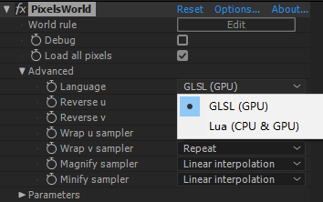
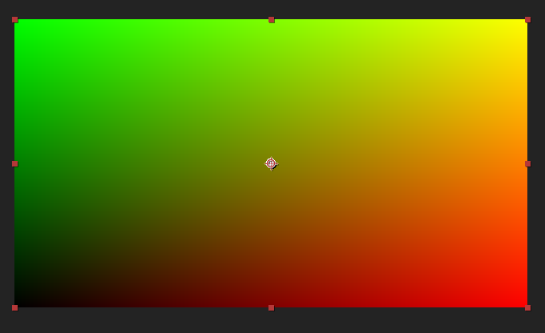

#Run GLSL Code
---
- GLSL代码请在**GLSL(GPU)** 模式下运行; 
<br>

- 在 "**World rule**"这单击"**Edit**"; 
- 此时，会有部分代码在面板显示。 
```glsl:default.shader
void main(){
	outColor = getColor(uv);
}
```
>此代码会把输入像素发送至输出像素。

- 你可以把 ``` getColor(uv) ```改为 ```vec4(uv,0.0,1.0)``` 以获得好看的uv色彩图案； 
```glsl:uvcolor.shader
void main(){
	outColor = vec4(uv,0.0,1.0);
}
```
- 接着, 单击 **"Ok"**即可。
- 正常情况下，应该会得到如下效果：
<br>
